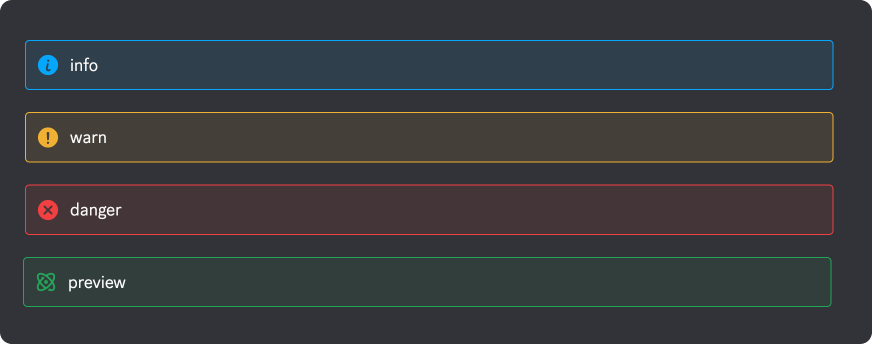
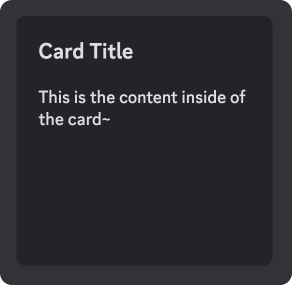

# Contributing

See the [README](https://github.com/discord/discord-api-docs/blob/main/README.md) for licensing and legal information.

## Types of Changes

### Wanted Changes

1. Fixes to incorrect statements or inaccuracies within the documentation.
1. Rewording or extending documentation to clarify unclear wording or complicated explanations.
1. Additions that fill gaps or missing pieces in the current documentation.
1. Fixing of spelling and grammatical errors in the documentation.

### Unwanted Changes

1. Whitespace or formatting changes.
1. Subjective wording changes.
1. Modifications to the overall structure and format of the API docs.
1. Additions that replicate or needlessly restructure current documentation.
1. Additions that document unreleased product functionality.
1. Changes that modify [Community Resources](https://discord.com/developers/docs/topics/community-resources#community-resources) (see [guidelines](https://github.com/discord/discord-api-docs/discussions/4456) for more detail).

## Markdown Syntax

This repository uses special markdown syntax that helps style the resulting web version of the documentation.

### H6 Headings

H6 headings should be used above tables and code blocks to properly label them.

### Linking

Links between docs can be achieved by using a hash symbol (#), plus the markdown file name, plus a slash, and finally the dash-separated anchor. For instance, to link to the above H6 heading section:

```md
[Links to README.md H6](#README/h6-headings)
```

### Alert Boxes

Alert boxes are created using a block quote that has one of 'warn', 'danger', 'info', or 'preview' on the first line. 
For example:
```
> warn
> Something that requires warning here
```



### MDX Components

There are a few reusable MDX components that can be used on pages with the `mdx` extension. 

#### Collapsibles

Collapsibles allow you to show/hide content on a page that may be secondary to the page's primary content. They have four fields that can be set: `title`, `description`, `icon`, and an `open` flag (which makes the collapsible element open by default).

Available options for `icon`:
- `"list"`
- `"view"`
- `"question"`
- `"code"`
- `"warning"`

###### Example


```markdown
<Collapsible title="Title" description="Description text" icon="list">
Collapsed content
</Collapsible>
```

#### Buttons

Buttons are simply... clickable buttons. They take `href` and `color` as arguments, but currently we only use `"brand"` as a value for `color`.

###### Example


```markdown
<Button href="https://discord.com/developers/docs/getting-started" color="brand">click the button!</Button>
```

#### Cards

Cards let you display links in a card format. They accept two arguments, `title` and `link`.

###### Example



```markdown
<Card title="Card Title" link="https://discord.com/developers/docs/getting-started">
This is the content inside of the card~
</Card>
```
