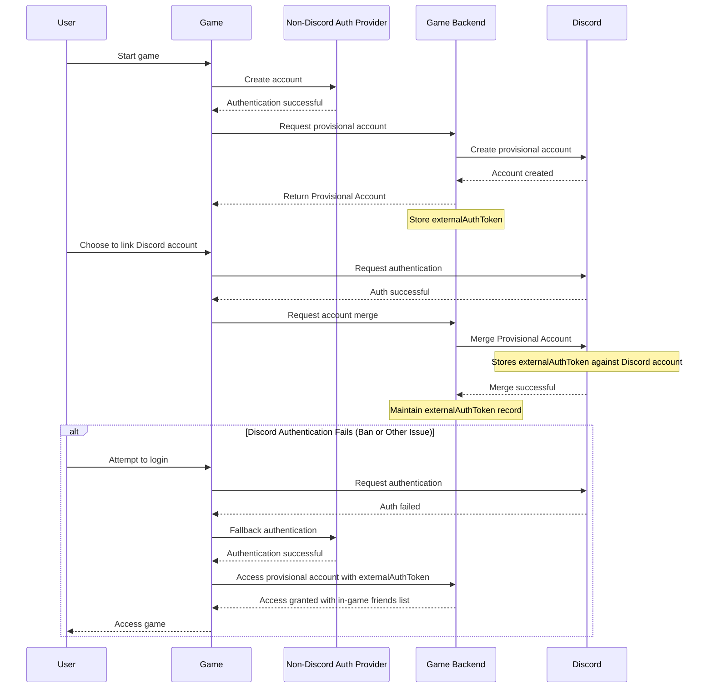

import PublicClient from '/snippets/discord-social-sdk/callouts/public-client.mdx';
import SupportCallout from '/snippets/discord-social-sdk/callouts/support.mdx';
import PresenceScopeCallout from '/snippets/discord-social-sdk/callouts/oauth-presence-scopes.mdx';

## Overview

<Tip>
New to account linking? Read the [Account Linking overview](/developers/platform/account-linking) to understand what it is, how it works, and which flow to use.
</Tip>

This guide explains how to authenticate users with their existing Discord accounts via OAuth2, enabling seamless login and access to Discord features.

### Flexible Account Options
If a player does not have a Discord account, you can use the SDK to [create a provisional account](/developers/discord-social-sdk/development-guides/provisional-accounts/overview) instead so that they can still access your game's features.

For the account linking integration flow we recommend — provisional account first, and Discord-linked
account second — see [Recommended Integration Path](#recommended-integration-path) below.

### Prerequisites

Before you begin, make sure you have:

- Read the [Core Concepts](/developers/discord-social-sdk/core-concepts) guide to understand:
  - OAuth2 authentication flow
  - Discord application setup
  - SDK initialization
- Set up your development environment with:
  - Discord application created in the [Developer Portal](https://discord.com/developers/applications)
  - Discord Social SDK downloaded and configured
  - Basic SDK integration working (initialization and connection)

If you haven't completed these prerequisites, we recommend first following the [Getting Started](/developers/discord-social-sdk/getting-started) guide.

<PresenceScopeCallout />

---


## Our Authentication Flow

OAuth2 is the standard authentication flow that allows users to sign in using their Discord account. The process follows these steps:

1. [Request authorization](/developers/discord-social-sdk/development-guides/account-linking-with-discord#step-1-request-authorization): Your game sends an authentication request to Discord.
2. [User Approval](/developers/discord-social-sdk/development-guides/account-linking-with-discord#step-2-user-approval): The user approves the request, granting access to your application.
3. [Receive Authorization Code](/developers/discord-social-sdk/development-guides/account-linking-with-discord#step-3-receiving-the-authorization-code): After approval, Discord redirects the user to your app with an authorization code.
4. [Exchange for Tokens](/developers/discord-social-sdk/development-guides/account-linking-with-discord#step-4-exchanging-the-authorization-code-for-an-access-token): The authorization code is exchanged for:
   - Access Token, which is valid for ~7 days
   - Refresh Token, used to obtain a new access token

<Info>
The OAuth2 flow requires a user's account to be verified
</Info>

### OAuth2 using the Discord Social SDK

- If the Discord client has [overlay support](https://support.discord.com/hc/en-us/articles/217659737-Game-Overlay-101) (Windows only), the OAuth2 login modal appears in your game instead of opening a browser.
- The SDK automatically handles redirects, simplifying the authentication flow.
- Some security measures, such as CSRF protection, are built-in, but you should always follow best practices to secure your app.

---

## Requesting Access Tokens

### Step 0: Configure OAuth2 Redirects
For OAuth2 to work correctly, you must **register the correct redirect URIs** for your app in the [**Discord Developer Portal**](https://discord.com/developers/applications/select/oauth2).

| Platform    | Redirect URI                                                                               |
|-------------|--------------------------------------------------------------------------------------------|
| **Desktop** | `http://127.0.0.1/callback`                                                                |
| **Mobile**  | `discord-APP_ID:/authorize/callback` _(replace `APP_ID` with your Discord application ID)_ |

### Step 1: Request Authorization 

The SDK provides helper methods to simplify OAuth2 login.

Use the [`Client::Authorize`] method to initiate authorization and allow the user to approve access.

#### Authorization Scopes

One of the required arguments to [`Client::Authorize`] is scopes — the set of permissions your game is requesting from the user. The Discord Social SDK provides two helper methods that cover the most common use cases:

| Helper Method                             | Scopes Requested                   | Features Enabled                                                                  |
|-------------------------------------------|------------------------------------|-----------------------------------------------------------------------------------|
| [`Client::GetDefaultPresenceScopes`]      | `openid sdk.social_layer_presence` | Account linking, friends list, rich presence                                      |
| [`Client::GetDefaultCommunicationScopes`] | `openid sdk.social_layer`          | All of the above, plus lobbies, voice chat, direct messaging, and linked channels |

Start with [`Client::GetDefaultPresenceScopes`] unless you know you need the communication features. You can always add more scopes later as your integration expands. See the [OAuth2 Scopes guide](/developers/discord-social-sdk/core-concepts/oauth2-scopes) for full details.

#### Authorization Code Verifier

If you are using [`Client::GetToken`] in [Step 4](/developers/discord-social-sdk/development-guides/account-linking-with-discord#step-4-exchanging-the-authorization-code-for-an-access-token), you will need to specify a "code challenge" and "code verifier" in your requests. We'll spare you the boring details of how that works (woo… crypto), as we've made a simple function to create these for you, [`Client::CreateAuthorizationCodeVerifier`], which you can use to generate the code challenge and verifier.

```cpp
// Create a code verifier and challenge if using GetToken
auto codeVerifier = client->CreateAuthorizationCodeVerifier();
discordpp::AuthorizationArgs args{};
args.SetClientId(YOUR_DISCORD_APPLICATION_ID);
args.SetScopes(discordpp::Client::GetDefaultPresenceScopes());
args.SetCodeChallenge(codeVerifier.Challenge());

client->Authorize(args, [client, codeVerifier](discordpp::ClientResult result, std::string code, std::string redirectUri) {
  if (!result.Successful()) {
    std::cerr << "❌ Authorization Error: " << result.Error() << std::endl;
  } else {
    std::cout << "✅ Authorization successful! Next step: exchange code for an access token \n";
  }
});
```

### Step 2: User Approval

After calling [`Client::Authorize`], the SDK will open a browser window, Discord client, or an in-game overlay to prompt the user to approve the request.

### Step 3: Receiving the Authorization Code

Once the user approves the request from Step 2, Discord will redirect the user back to your app with an authorization code that you can use to exchange for an access token.

### Step 4: Exchanging the Authorization Code for an Access Token

#### Server-to-Server Get Token Exchange

If your application uses a backend server and does **not** have `Public Client` enabled, you can manually exchange the authorization code for an access token using the Discord API.

``` python
import requests

API_ENDPOINT = 'https://discord.com/api/v10'
CLIENT_ID = 'YOUR_CLIENT_ID'
CLIENT_SECRET = 'YOUR_CLIENT_SECRET'

def exchange_code(code, redirect_uri, code_verifier):
    data = {
        'grant_type': 'authorization_code',
        'code': code,
        'redirect_uri': redirect_uri,
        'code_verifier': code_verifier
    }
    headers = {'Content-Type': 'application/x-www-form-urlencoded'}
    r = requests.post(f'{API_ENDPOINT}/oauth2/token', data=data, headers=headers, auth=(CLIENT_ID, CLIENT_SECRET))
    r.raise_for_status()
    return r.json()
```

#### Example Response

```json
{
  "access_token": "<access token>",
  "token_type": "Bearer",
  "expires_in": 604800,
  "refresh_token": "<refresh token>",
  "scope": "sdk.social_layer"
}
```

#### Token Exchange for Public Clients

<PublicClient />

If your app does not have a backend server, enable `Public Client` in the Discord Developer Portal and use [`Client::GetToken`] to automatically exchange the authorization code for a token.

We will also need the code verifier used to generate the code challenge in Step 1.

```cpp
client->GetToken(YOUR_DISCORD_APPLICATION_ID, code, codeVerifier.Verifier(), redirectUri,
  [client](discordpp::ClientResult result,
    std::string accessToken,
    std::string refreshToken,
    discordpp::AuthorizationTokenType tokenType,
    int32_t expiresIn,
    std::string scope) {
    std::cout << "🔓 Access token received! Establishing connection...\n";
    // Next step: Update the token in the client and connect to Discord
  });
```

---

## Working with Tokens

Once you've received your access token, you'll want to set the token in the SDK. You can use [`Client::UpdateToken`] to do that. At this point, you're authorized and ready to go! You'll want to store the player's access token and refresh tokens somewhere.

Please note that the `access_token` values do expire. You'll need to use the `refresh_token` to refresh the player's access token.

```cpp
client->UpdateToken(discordpp::AuthorizationTokenType::Bearer, ACCESS_TOKEN_VALUE, [client](discordpp::ClientResult result) {
  client->Connect();
);
```

---

## Refreshing Access Tokens

Access tokens expire after 7 days, requiring refresh tokens to get a new one.

### Server-to-Server Token Refresh

If you're handling authentication on your server, send an API request to refresh the token.

```python
import requests

API_ENDPOINT = 'https://discord.com/api/v10'
CLIENT_ID = 'YOUR_CLIENT_ID'
CLIENT_SECRET = 'YOUR_CLIENT_SECRET'

def refresh_token(refresh_token):
    data = {
        'grant_type': 'refresh_token',
        'refresh_token': refresh_token
    }
    headers = {'Content-Type': 'application/x-www-form-urlencoded'}
    r = requests.post(f'{API_ENDPOINT}/oauth2/token', data=data, headers=headers, auth=(CLIENT_ID, CLIENT_SECRET))
    r.raise_for_status()
    return r.json()
```

### Refreshing Access Tokens for Public Clients

<PublicClient />

The easiest way to refresh tokens is using the SDK's [`Client::RefreshToken`] method.

``` cpp
client->RefreshToken(
      YOUR_DISCORD_APPLICATION_ID, GetRefreshToken(),
      [client](discordpp::ClientResult result, std::string accessToken,
               std::string refreshToken,
               discordpp::AuthorizationTokenType tokenType, int32_t expiresIn,
               std::string scope) {
        if (!result.Successful()) {
          std::cout << "❌ Error refreshing token: " << result.Error()
                    << std::endl;
          return;
        }

        // Update token and connect
        UpdateToken(client, refreshToken, accessToken);
      });
```

### When Refresh Fails

A stored refresh token can become invalid between sessions for several reasons:

- The user revoked your application from their *User Settings → Authorized Apps* page.
- You called the [unmerge or token revocation endpoint](#revoking-access-tokens).
- The [user's Discord account was banned](/developers/discord-social-sdk/development-guides/provisional-accounts/unmerging-accounts#ban-driven-unmerge).
- The access and refresh tokens expired or otherwise became invalid, with no revocation, unmerge, or ban involved.

In every one of these cases the response on `/oauth2/token` with `grant_type=refresh_token` is identical:

- **HTTP status:** `400`
- **Body:** `{ "error": "invalid_grant", "error_description": "Invalid \"refresh_token\" in request" }`

There is no ban-specific or unlink-specific error code on this path. `invalid_grant` only tells you the refresh token is no longer valid server-side — not *why* — so you cannot tell from the error alone which of the situations above you are in.

#### Recovering from `invalid_grant`

How you recover depends on whether the user still has a linked Discord account. Because the `invalid_grant` error doesn't distinguish the cases, the robust pattern is to **attempt the provisional account fallback first, then handle error `530010`**:

1. Drop the stored Discord tokens for the user and attempt the [provisional account flow](/developers/discord-social-sdk/development-guides/provisional-accounts/overview#implementing-provisional-accounts).
2. **If the provisional flow succeeds**, a revocation, unmerge, or ban had already reverted the linked account to a [provisional account](#revoking-access-tokens). The player stays in-game even though their Discord link is gone.
3. **If the provisional flow returns error code `530010`** — `User account is non-provisional and should be authed through OAuth2` — the tokens simply expired or became invalid and the user **still has a linked Discord account**. The token-exchange endpoint deliberately blocks linked users from the provisional path. Prompt the player to re-run the [OAuth2 authorization flow](#step-1-request-authorization) to obtain fresh tokens instead.

<Tip>
To be notified when a user's authorization for your app is revoked — whether by an unlink, a token revocation, or a Discord account ban — integrate the [`APPLICATION_DEAUTHORIZED`](/developers/events/webhook-events#application-deauthorized) webhook event. That gives you a proactive signal you can act on immediately, rather than discovering the change the next time a refresh fails.
</Tip>

---

## Revoking Access Tokens

A user's authorization for your app can be revoked in several ways — by your own backend, by the user from Discord's UI, or by Discord itself when an account is banned. Regardless of how the revocation is triggered:

- The user's access and refresh tokens are immediately invalidated. Any subsequent refresh on `/oauth2/token` returns `HTTP 400` with `error: "invalid_grant"` (see [When Refresh Fails](#when-refresh-fails)).
- An [`APPLICATION_DEAUTHORIZED`](/developers/events/webhook-events#application-deauthorized) webhook is fired to your app.

<Info>
For Discord Social SDK-integrated apps, every revocation path in this section is mechanically an [unmerge](/developers/discord-social-sdk/development-guides/provisional-accounts/unmerging-accounts#unmerging-provisional-accounts): the merged Discord account reverts to a new provisional account carrying the original `external_auth_token`. This holds whether revocation comes from `/oauth2/token/revoke`, `Client::RevokeToken`, the user removing your app from Discord's UI, or a ban. Only [ban-driven unmerges](/developers/discord-social-sdk/development-guides/provisional-accounts/unmerging-accounts#ban-driven-unmerge) create a *restricted* provisional account — the others create an unrestricted one that can be re-merged freely.
</Info>

You'll naturally know about revocations your own code initiates. For revocations triggered outside your code — see [Out-of-Band Revocation](#out-of-band-revocation) below — the webhook is the only proactive way to find out.

<Warning>
When any valid access or refresh token is revoked, all of your application's access and refresh tokens for that user are immediately invalidated.
</Warning>

### Server-to-Server Token Revocation

If your application uses a backend server, you can revoke tokens by making an API request to Discord's token revocation endpoint.

```python
import requests

API_ENDPOINT = 'https://discord.com/api/v10'
CLIENT_ID = 'YOUR_CLIENT_ID'
CLIENT_SECRET = 'YOUR_CLIENT_SECRET'

def revoke_token(access_or_refresh_token):
    data = {'token': access_or_refresh_token}
    headers = {'Content-Type': 'application/x-www-form-urlencoded'}
    r = requests.post(f'{API_ENDPOINT}/oauth2/token/revoke', data=data, headers=headers, auth=(CLIENT_ID, CLIENT_SECRET))
    r.raise_for_status()
```

### Revoking Access Tokens for Public Clients

<PublicClient />

The easiest way to revoke tokens is using the SDK's `Client::RevokeToken` method. This will invalidate all access and refresh tokens for the user and they cannot be used again.

```cpp
client->RevokeToken(YOUR_DISCORD_APPLICATION_ID,
                    accessToken, // Can also use refresh token
                    [](const discordpp::ClientResult &result) {
                      if (!result.Successful()) {
                        std::cout
                            << "? Error revoking token: " << result.Error()
                            << std::endl;
                        return;
                      }

                      std::cout
                          << "? Token successfully revoked! User logged out."
                          << std::endl;
                      // Handle successful logout (clear stored tokens,
                      // redirect to login, etc.)
                    });
```

### Out-of-Band Revocation

Two paths sever the user's Discord link without your code calling any unmerge or revoke endpoint:

- The user removes your app from their Discord *User Settings → Authorized Apps* page (a [user-initiated unmerge](/developers/discord-social-sdk/development-guides/provisional-accounts/unmerging-accounts#out-of-band-unmerge)).
- The user's Discord account is banned (a [ban-driven unmerge](/developers/discord-social-sdk/development-guides/provisional-accounts/unmerging-accounts#ban-driven-unmerge), with an additional cross-platform-restricted state on the new provisional account).

Subscribe to [`APPLICATION_DEAUTHORIZED`](/developers/events/webhook-events#application-deauthorized) to be notified when either happens. If you miss the webhook, the [next token use will fail](#when-refresh-fails) and your game should fall back to the [provisional account flow](/developers/discord-social-sdk/development-guides/provisional-accounts/overview#implementing-provisional-accounts).

---

## Recommended Integration Path

The recommended path for integrating the Discord Social SDK is that your game has a primary authentication other than Discord that initially sets up a provisional account, and have the player link their Discord account to this primary authentication.

This approach protects your users' game access and data if they encounter issues with their Discord account, such as a permanent or temporary ban. To implement this recommended path:

1. Create an account through a [non-Discord authentication provider](/developers/discord-social-sdk/development-guides/provisional-accounts/identity-providers#configuring-your-identity-provider), and create a provisional account attached to it.
2. When users later authenticate through Discord to link their account, have your game back end execute the [merge their provisional account with their Discord Account](/developers/discord-social-sdk/development-guides/provisional-accounts/merging-accounts#merging-provisional-accounts).
3. The account merging process will internally store the `externalAuthToken` from the provisional account against their Discord account. If a ban of the Discord account happens, that `externalAuthToken` will be attached to the new provisional account that is created in its stead, with the original Discord account's in-game friends, and will be available through the authentication provider the account was initially setup with.
4. As a last step, your game back end should maintain the record of the `externalAuthToken` against the user account, even after the account merging process, since it will be needed to [authenticate via a provisional account](/developers/discord-social-sdk/development-guides/provisional-accounts/overview#implementing-provisional-accounts) should Discord authentication fails for a ban, or any other reason.



<Warning>
If you use Discord as the primary or sole authentication mechanism for your game, you risk players permanently losing access to their in-game data if their Discord account is banned, as there is no way to migrate them to a provisional account that is connected to an external authentication provider.
</Warning>

---

## Next Steps

Now that you've successfully implemented account linking with Discord, you can integrate more social features into your game.

import {PaintPaletteIcon} from '/snippets/icons/PaintPaletteIcon.jsx'
import {ListViewIcon} from '/snippets/icons/ListViewIcon.jsx'
import {UserIcon} from '/snippets/icons/UserIcon.jsx'

<CardGroup cols={3}>
  <Card title="Design: Signing In" href="/developers/discord-social-sdk/design-guidelines/signing-in" icon={<PaintPaletteIcon />}>
    Design guidelines for account linking and user authentication
  </Card>
  <Card title="Creating a Unified Friends List" href="/developers/discord-social-sdk/development-guides/creating-a-unified-friends-list" icon={<ListViewIcon />}>
    Combine Discord and game friends into a single list for easy management.
  </Card>
  <Card title="Setting Rich Presence" href="/developers/discord-social-sdk/development-guides/setting-rich-presence" icon={<UserIcon />}>
    Display game status and information to Discord friends.
  </Card>  
</CardGroup>

<SupportCallout />

---

## Change Log

| Date           | Changes                                                     |
|----------------|-------------------------------------------------------------|
| June 9, 2026   | Clarify `invalid_grant` recovery and the `530010` error     |
| May 22, 2026   | Add out-of-band revocation and recommended integration path |
| March 17, 2025 | initial release                                             |

{/* Autogenerated Reference Links */}
[`Client::Authorize`]: https://discord.com/developers/docs/social-sdk/classdiscordpp_1_1Client.html#ace94a58e27545a933d79db32b387a468
[`Client::CreateAuthorizationCodeVerifier`]: https://discord.com/developers/docs/social-sdk/classdiscordpp_1_1Client.html#aba6adc1f978e7bf4c5433c560e1ad704
[`Client::GetDefaultCommunicationScopes`]: https://discord.com/developers/docs/social-sdk/classdiscordpp_1_1Client.html#a71499da752fbdc2d4326ae0fd36c0dd1
[`Client::GetDefaultPresenceScopes`]: https://discord.com/developers/docs/social-sdk/classdiscordpp_1_1Client.html#a7648bd1d2f7d9a86ebd0edb8bef12b5c
[`Client::GetToken`]: https://discord.com/developers/docs/social-sdk/classdiscordpp_1_1Client.html#aaee636f91fb1ea3465157c20313b702c
[`Client::RefreshToken`]: https://discord.com/developers/docs/social-sdk/classdiscordpp_1_1Client.html#a187af0f99f94b3b9a4ad4302f6a443e7
[`Client::UpdateToken`]: https://discord.com/developers/docs/social-sdk/classdiscordpp_1_1Client.html#a606b32cef7796f7fb91c2497bc31afc4