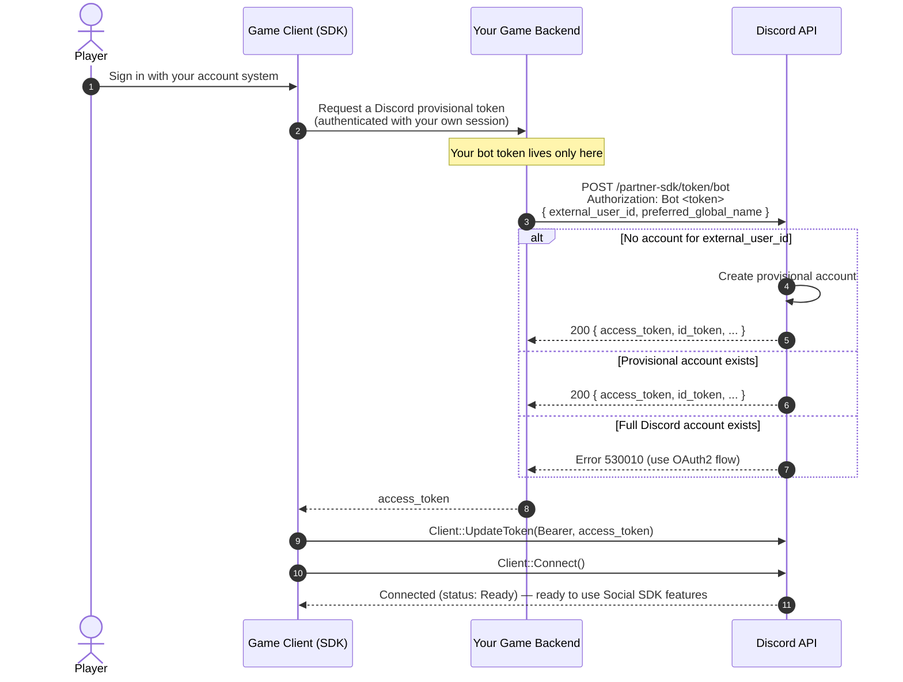

import {WrenchIcon} from '/snippets/icons/WrenchIcon.jsx'
import {LinkIcon} from '/snippets/icons/LinkIcon.jsx'
import {SlashBoxIcon} from '/snippets/icons/SlashBoxIcon.jsx'
import SupportCallout from '/snippets/discord-social-sdk/callouts/support.mdx';
import ProvisionalAccountErrors from '/snippets/discord-social-sdk/partials/provisional-account-errors.mdx';

## Server Authentication with Bot Token Endpoint

<Tip>
    This is the preferred method of authentication. It ends up being the simplest and most flexible choice for most
    provisional account integrations.
</Tip>

Use the Bot Token Endpoint if your game has an account system which uniquely identifies users.

You pass your account system's unique ID for the user, and Discord returns an access token — creating a provisional account for that identity if one does not already exist.

No identity provider configuration is required for this method.

If you have a hard requirement for a turnkey OIDC integration, see [External Credentials Exchange](/developers/discord-social-sdk/development-guides/provisional-accounts/external-credentials-exchange); if you don't have a backend, see [Public Client Integration](/developers/discord-social-sdk/development-guides/provisional-accounts/public-client).

<Warning>
Your bot token is a privileged secret — it must stay on your backend and **never ship in the game client**. The client receives only the provisional `access_token` your backend returns. See [How the Integration Fits Together](#how-the-integration-fits-together) for the full flow.
</Warning>

### Server: Create the Provisional Token

Your backend exchanges the player's identity for a Discord access token. Keep this call and your bot token on the
server, exposed to the client through your own authenticated endpoint:

```python
# filepath: your_game/server/auth.py
import requests
from models import GameAccount

def get_provisional_token(game_account: GameAccount):
  response = requests.post(
    'https://discord.com/api/v10/partner-sdk/token/bot',
    headers={
      'Content-Type': 'application/json',
      'Authorization': 'Bot <BOT_TOKEN>' # your application's bot token
    },
    json={
      'external_user_id': game_account.id,       # your account system's unique id
      'preferred_global_name': game_account.display_name, # your account system's display name for the user
    }
  )
  return response.json()
```

#### Bot Token Endpoint Response

```python
{
  "access_token": "<access token>",
  "id_token": "<id token>",
  "token_type": "Bearer",
  "expires_in": 604800,
  "scope": "sdk.social_layer"
}
```

### Client: Connect With the Token

The game client receives the `access_token` from your backend — it never sees the bot token — and passes it straight to the SDK. Set your application ID, call [`Client::UpdateToken`] with the token as a `Bearer` token, then [`Client::Connect`]:

```cpp
// filepath: your_game/client/connect.cpp
// `accessToken` was returned by YOUR backend, not requested directly from Discord.
client->SetApplicationId(DISCORD_APPLICATION_ID);

client->UpdateToken(discordpp::AuthorizationTokenType::Bearer, accessToken,
    [client](discordpp::ClientResult result) {
      if (result.Successful()) {
        client->Connect();
      } else {
        std::cerr << "Failed to update token: " << result.Error() << '\n';
      }
    });
```

### How the Integration Fits Together

Because your bot token never reaches the client, the client can't call Discord's bot token endpoint directly. Instead, your server brokers the request:

1. The player signs in with your own account system, as they normally would.
2. The game client asks **your backend** for a Discord provisional token.
3. Your backend calls Discord's `/partner-sdk/token/bot` endpoint — authenticated with your bot token — passing the player's `external_user_id` (and optional `preferred_global_name`), and returns the resulting `access_token` to the client.
4. The client hands that token to the SDK with [`Client::UpdateToken`] and calls [`Client::Connect`].



Once authentication is complete, you can use the access token as you would a full Discord user's access token. See [Managing Provisional Accounts](/developers/discord-social-sdk/development-guides/provisional-accounts/managing-accounts) for token refresh, storage, and display names.

## Error Handling

<ProvisionalAccountErrors />

---

## Next Steps

<CardGroup cols={3}>
  <Card title="Managing Provisional Accounts" href="/developers/discord-social-sdk/development-guides/provisional-accounts/managing-accounts" icon={<WrenchIcon />}>
    Refresh access tokens and set display names.
  </Card>
  <Card title="Merging Accounts" href="/developers/discord-social-sdk/development-guides/provisional-accounts/merging-accounts" icon={<LinkIcon />}>
    Merge a provisional account into a full Discord account.
  </Card>
  <Card title="Unmerging Accounts" href="/developers/discord-social-sdk/development-guides/provisional-accounts/unmerging-accounts" icon={<SlashBoxIcon />}>
    Sever the link between a Discord account and a provisional account.
  </Card>
</CardGroup>

<SupportCallout />

---

## Change Log

| Date           | Changes                                                            |
|----------------|--------------------------------------------------------------------|
| July 14, 2026  | Split into its own page with the client-to-server integration flow |
| March 17, 2025 | Initial release                                                    |

{/* Autogenerated Reference Links */}
[`Client::Connect`]: https://discord.com/developers/docs/social-sdk/classdiscordpp_1_1Client.html#a873a844c7c4c72e9e693419bb3e290aa
[`Client::UpdateToken`]: https://discord.com/developers/docs/social-sdk/classdiscordpp_1_1Client.html#a606b32cef7796f7fb91c2497bc31afc4