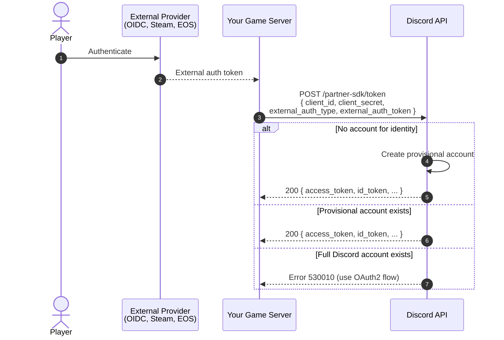

import SupportCallout from '/snippets/discord-social-sdk/callouts/support.mdx';
import ProvisionalAccountErrors from '/snippets/discord-social-sdk/partials/provisional-account-errors.mdx';
import ProvisionalAccountOidcErrors from '/snippets/discord-social-sdk/partials/provisional-account-oidc-errors.mdx';
import {UserPlatformIcon} from '/snippets/icons/UserPlatformIcon.jsx'
import {WrenchIcon} from '/snippets/icons/WrenchIcon.jsx'

## Server Authentication with External Credentials Exchange

<Warning>
**Prefer the [Bot Token Endpoint](/developers/discord-social-sdk/development-guides/provisional-accounts/bot-token-endpoint) if your game has an account system that uniquely identifies users.** It is simpler, requires no identity provider configuration, and is the recommended approach for most integrations.

Use External Credentials Exchange only if you have a hard requirement for a server-side custom OIDC integration. If you don't have a server-authoritative backend, use [Public Client Integration](/developers/discord-social-sdk/development-guides/provisional-accounts/public-client) instead.
</Warning>

Before using this method, you must [configure your identity provider](/developers/discord-social-sdk/development-guides/provisional-accounts/identity-providers) in the Developer Portal. Exchange the external provider's token for a Discord access token from your game server:

```python
# filepath: your_game/server/auth.py
import requests

def get_provisional_token(external_token: str):
  response = requests.post(
    'https://discord.com/api/v10/partner-sdk/token',
    json={
      'client_id': CLIENT_ID,
      'client_secret': CLIENT_SECRET,
      'external_auth_type': EXTERNAL_AUTH_TYPE,  # See External Auth Types
      'external_auth_token': external_token
    }
  )
  return response.json()
```

See the [External Auth Types](/developers/discord-social-sdk/development-guides/provisional-accounts/identity-providers#external-auth-types) table for the full list of supported `external_auth_type` values.


#### External Credentials Exchange Response

```python
{
  "access_token": "<access token>",
  "id_token": "<id token>",
  "token_type": "Bearer",
  "expires_in": 604800,
  "scope": "sdk.social_layer"
}
```

<Info>
    If you are using OIDC, you may see a `refresh_token` in this response. Using it via the OAuth2 `refresh_token` grant is **deprecated** — re-authenticate using a fresh provider token instead. See [Refreshing Access Tokens](/developers/discord-social-sdk/development-guides/provisional-accounts/managing-accounts#refreshing-access-tokens) for details.
</Info>


### How the Flow Works



Once authentication is complete, you can use the access token as you would a full Discord user's access token. See [Managing Provisional Accounts](/developers/discord-social-sdk/development-guides/provisional-accounts/managing-accounts) for token refresh, storage, and display names.

## Error Handling

<ProvisionalAccountErrors />

<ProvisionalAccountOidcErrors />

---

## Next Steps

<CardGroup cols={2}>
  <Card title="Configuring Identity Providers" href="/developers/discord-social-sdk/development-guides/provisional-accounts/identity-providers" icon={<UserPlatformIcon />}>
    Set up OIDC, Steam, EOS, and other providers, and review the OIDC requirements.
  </Card>
  <Card title="Managing Provisional Accounts" href="/developers/discord-social-sdk/development-guides/provisional-accounts/managing-accounts" icon={<WrenchIcon />}>
    Refresh access tokens and set display names.
  </Card>
</CardGroup>

<SupportCallout />

---

## Change Log

| Date           | Changes                                                   |
|----------------|-----------------------------------------------------------|
| July 14, 2026  | Split the provisional accounts guide into its own section |
| March 17, 2025 | Initial release                                           |
