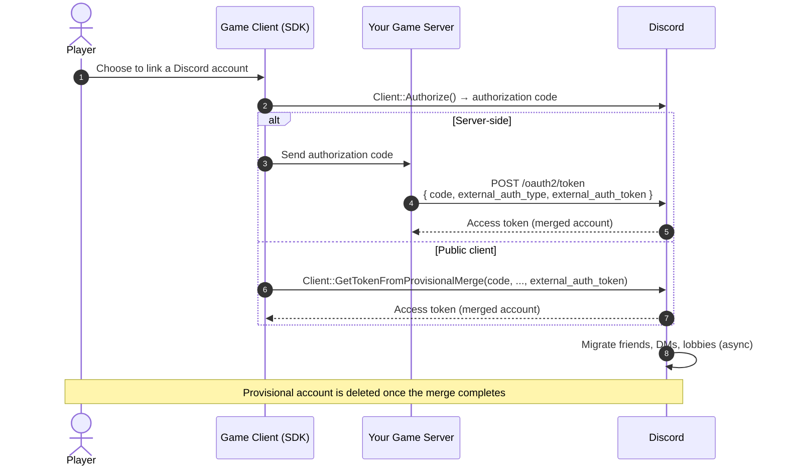
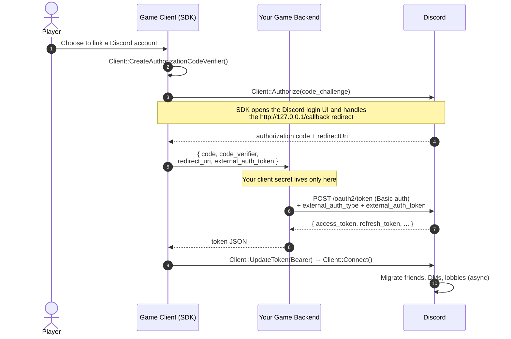

import PublicClient from '/snippets/discord-social-sdk/callouts/public-client.mdx';
import SupportCallout from '/snippets/discord-social-sdk/callouts/support.mdx';
import {SlashBoxIcon} from '/snippets/icons/SlashBoxIcon.jsx'
import {PaintPaletteIcon} from '/snippets/icons/PaintPaletteIcon.jsx'
import {LinkIcon} from '/snippets/icons/LinkIcon.jsx'

## Merging Provisional Accounts

When a player wants to convert their provisional account to a full Discord account, we start a special version of the [access token request flow](/developers/discord-social-sdk/development-guides/account-linking-with-discord#requesting-access-tokens) where the provisional user's external identity is included.

- If you have a backend, follow [Merging Provisional Accounts for Servers](#merging-provisional-accounts-for-servers).
- If you do not have a backend, follow [Merging Provisional Accounts for Public Clients](#merging-provisional-accounts-for-public-clients).

<Note>
Unlike other API rate limits, the merge operation has a strict per-user limit since account merging is not something we expect to happen frequently. Under normal circumstances, a player will only ever link their account once.

If you are testing your merge integration, make sure to add your QA users to your application's [App Testers](https://discord.com/developers/applications/select/testers) list to avoid hitting rate limits during testing.
</Note>

## How Merging Works

Regardless of whether you merge server-side or from a public client, the flow starts with the standard [`Client::Authorize`] step and ends with Discord migrating the provisional account's data into the full Discord account.



---

## Merging Provisional Accounts for Servers

Merging still begins on the client with [`Client::Authorize`], but the token exchange must run on your backend because it requires your **client secret** — which must never ship in the game client. The client drives the authorization flow; the backend holds the secret and performs the exchange.

1. The client creates a PKCE verifier and calls [`Client::Authorize`] with its code challenge. The SDK opens the Discord login UI and handles the redirect at `http://127.0.0.1/callback` itself, then returns the authorization `code` and the `redirectUri` to your callback.
2. The client sends the `code`, the PKCE `code_verifier`, the `redirectUri`, and the provisional account's `external_auth_token` to your backend.
3. Your backend exchanges the code at `/oauth2/token` — authenticated with your client ID and secret — adding `external_auth_type` and `external_auth_token`, and returns Discord's token JSON to the client.
4. The client passes the returned access token to [`Client::UpdateToken`] and calls [`Client::Connect`]. The token exchange completes immediately, but Discord migrates the account's data asynchronously (see [Data Migration During Merging](#data-migration-during-merging)) to the newly linked Discord account.



### Client: Start the Authorization Flow

On the client, create a PKCE verifier, call [`Client::Authorize`], and in the callback hand the `code` — along with the `code_verifier`, `redirectUri`, and the provisional account's `external_auth_token` — to your backend. Pass the merged access token your backend returns to [`Client::UpdateToken`], then [`Client::Connect`]:

```cpp
// filepath: your_game/client/merge.cpp
auto codeVerifier = client->CreateAuthorizationCodeVerifier();

discordpp::AuthorizationArgs args{};
args.SetClientId(YOUR_DISCORD_APPLICATION_ID);
// Request the scopes your features need — communication scopes are required to send DMs.
args.SetScopes(discordpp::Client::GetDefaultCommunicationScopes());
args.SetCodeChallenge(codeVerifier.Challenge());

// The provisional account's external_auth_token. For the Bot Token Endpoint this is
// the access_token you received when the provisional account was created.
std::string externalAuthToken = GetProvisionalAccessToken();

client->Authorize(args, [client, codeVerifier, externalAuthToken](
    discordpp::ClientResult result, std::string code, std::string redirectUri) {
  if (!result.Successful()) {
    std::cerr << "❌ Authorization Error: " << result.Error() << std::endl;
    return;
  }

  // POST { code, code_verifier, redirect_uri, external_auth_token } to YOUR backend,
  // which holds the client secret and performs the /oauth2/token merge exchange.
  std::string accessToken =
      MergeOnBackend(code, codeVerifier.Verifier(), redirectUri, externalAuthToken);

  // Connect with the merged account's access token — no reconnect of the flow needed.
  client->UpdateToken(discordpp::AuthorizationTokenType::Bearer, accessToken,
      [client](discordpp::ClientResult result) {
        if (result.Successful()) {
          client->Connect();
        } else {
          std::cerr << "❌ Failed to update token: " << result.Error() << std::endl;
        }
      });
});
```

### Backend: Exchange the Code for a Merged Token

Extend the standard [OAuth2 token exchange](/developers/topics/oauth2#authorization-code-grant-access-token-exchange-example) by posting to `/oauth2/token` with two additional parameters — `external_auth_type` and `external_auth_token`. Discord uses these to identify the provisional account and merge it into the full Discord account associated with the provided authorization code or device code.

If you created the provisional account using the [Bot Token Endpoint](/developers/discord-social-sdk/development-guides/provisional-accounts/bot-token-endpoint), use `DISCORD_BOT_ISSUED_ACCESS_TOKEN` as the `external_auth_type` and the `access_token` returned by that endpoint (see [Bot Token Endpoint Response](/developers/discord-social-sdk/development-guides/provisional-accounts/bot-token-endpoint#bot-token-endpoint-response)) as the `external_auth_token` — **not** the `external_user_id`.

If you used [External Credentials Exchange](/developers/discord-social-sdk/development-guides/provisional-accounts/external-credentials-exchange),
the `external_auth_token` is the same credential you provided when creating the provisional account — for example, your OIDC identity token, Steam session ticket, or EOS access token.

See the [External Auth Types](/developers/discord-social-sdk/development-guides/provisional-accounts/identity-providers#external-auth-types) table for the full list of supported `external_auth_type` values.

<Tip>
The bot-issued `external_auth_token` is the **access token**, because the merge runs through the OAuth2 `/oauth2/token` endpoint and the token is what proves the external identity. This differs from the [bot unmerge endpoint](/developers/discord-social-sdk/development-guides/provisional-accounts/unmerging-accounts#unmerging-with-bot-token-endpoint), which is authenticated by your bot token and therefore identifies the account by `external_user_id` instead.
</Tip>

#### Desktop & Mobile

**Request Body Parameters**

| Parameter             | Description                                                                                                                                                                                                                                                           |
|-----------------------|-----------------------------------------------------------------------------------------------------------------------------------------------------------------------------------------------------------------------------------------------------------------------|
| `grant_type`          | Must be `authorization_code`. This is the standard [OAuth2 authorization code grant](/developers/topics/oauth2#authorization-code-grant-access-token-exchange-example) — the authorization code from the [`Client::Authorize`] flow is exchanged for an access token. |
| `code`                | The authorization code returned to your server after the user completes the [`Client::Authorize`] flow.                                                                                                                                                               |
| `redirect_uri`        | The redirect URI from the authorization request. The SDK returns this in the [`Client::Authorize`] callback — forward it to your backend unchanged; it must match exactly.                                                                                            |
| `code_verifier`       | The PKCE code verifier from [`Client::CreateAuthorizationCodeVerifier`], forwarded from the client. Required because [`Client::Authorize`] sends a code challenge.                                                                                                    |
| `external_auth_type`  | The type of external identity provider. See [External Auth Types](/developers/discord-social-sdk/development-guides/provisional-accounts/identity-providers#external-auth-types).                                                                                     |
| `external_auth_token` | The external identity token. For example, for `OIDC`, this is the OIDC identity token. For `DISCORD_BOT_ISSUED_ACCESS_TOKEN`, this is the `access_token` returned by the Bot Token Endpoint (not the `external_user_id`).                                             |

```python
import requests

API_ENDPOINT = 'https://discord.com/api/v10'
CLIENT_ID = '332269999912132097'
CLIENT_SECRET = '937it3ow87i4ery69876wqire'
# See External Auth Types for all supported values
EXTERNAL_AUTH_TYPE = 'DISCORD_BOT_ISSUED_ACCESS_TOKEN'

def exchange_code_with_merge(code, redirect_uri, code_verifier, external_auth_token):
  data = {
    'grant_type': 'authorization_code',
    'code': code,
    'redirect_uri': redirect_uri,
    'code_verifier': code_verifier,           # PKCE verifier forwarded from the client
    'external_auth_type': EXTERNAL_AUTH_TYPE,
    'external_auth_token': external_auth_token
  }
  headers = {
    'Content-Type': 'application/x-www-form-urlencoded'
  }
  r = requests.post('%s/oauth2/token' % API_ENDPOINT, data=data, headers=headers, auth=(CLIENT_ID, CLIENT_SECRET))
  r.raise_for_status()
  return r.json()
```

#### Console

**Request Body Parameters**

| Parameter             | Description                                                                                                                                                                                                               |
|-----------------------|---------------------------------------------------------------------------------------------------------------------------------------------------------------------------------------------------------------------------|
| `grant_type`          | Must be `urn:ietf:params:oauth:grant-type:device_code`. This is the [RFC 8628](https://www.rfc-editor.org/rfc/rfc8628) device authorization grant, used for consoles and devices without a browser.                       |
| `device_code`         | The device code from the device authorization flow. See [Account Linking on Consoles](/developers/discord-social-sdk/development-guides/account-linking-on-consoles).                                                     |
| `external_auth_type`  | The type of external identity provider. See [External Auth Types](/developers/discord-social-sdk/development-guides/provisional-accounts/identity-providers#external-auth-types).                                         |
| `external_auth_token` | The external identity token. For example, for `OIDC`, this is the OIDC identity token. For `DISCORD_BOT_ISSUED_ACCESS_TOKEN`, this is the `access_token` returned by the Bot Token Endpoint (not the `external_user_id`). |

```python
import requests

API_ENDPOINT = 'https://discord.com/api/v10'
CLIENT_ID = '332269999912132097'
CLIENT_SECRET = '937it3ow87i4ery69876wqire'
# See External Auth Types for all supported values
EXTERNAL_AUTH_TYPE = 'DISCORD_BOT_ISSUED_ACCESS_TOKEN'

def exchange_device_code_with_merge(device_code, external_auth_token):
  data = {
    'grant_type': 'urn:ietf:params:oauth:grant-type:device_code',
    'device_code': device_code,
    'external_auth_type': EXTERNAL_AUTH_TYPE,
    'external_auth_token': external_auth_token
  }
  headers = {
    'Content-Type': 'application/x-www-form-urlencoded'
  }
  r = requests.post('%s/oauth2/token' % API_ENDPOINT, data=data, headers=headers, auth=(CLIENT_ID, CLIENT_SECRET))
  r.raise_for_status()
  return r.json()
```

#### Merge Request Response

```json
{
  "access_token": "<access token>",
  "token_type": "Bearer",
  "expires_in": 604800,
  "refresh_token": "<refresh token>",
  "scope": "sdk.social_layer"
}
```

---

## Merging Provisional Accounts for Public Clients

<PublicClient />

If you do not have a backend, leverage the [`Client::GetTokenFromProvisionalMerge`] (Desktop & Mobile) or [`Client::GetTokenFromDeviceProvisionalMerge`] (Console) method, which will handle the entire process for you. You'll want to first enable Public Client on your Discord application's OAuth2 tab on the Discord developer portal. You can then leverage the [`Client::GetTokenFromProvisionalMerge`] or [`Client::GetTokenFromDeviceProvisionalMerge`] method using just the client.

This function should be used with the [`Client::Authorize`] function whenever a user with a provisional account wants to link an existing Discord account, merging their provisional account into that full Discord account.

The account merging process starts like the normal login flow, invoking the [`Client::Authorize`] method to get an authorization code back. Instead of calling `GetToken`, call this function and pass on the provisional user's identity.

Discord can then find the provisional account with that identity and the new Discord account and merge any data as necessary.

See the documentation for [`Client::GetToken`] for more details on the callback. Note that the callback will be invoked when the token exchange is complete, but merging accounts happens asynchronously and will not be complete yet.

```cpp
// Create a code verifier and challenge if using GetToken
auto codeVerifier = client->CreateAuthorizationCodeVerifier();
discordpp::AuthorizationArgs args{};
args.SetClientId(YOUR_DISCORD_APPLICATION_ID);
// Request the scopes your features need — communication scopes are required to send DMs.
args.SetScopes(discordpp::Client::GetDefaultCommunicationScopes());
args.SetCodeChallenge(codeVerifier.Challenge());

client->Authorize(args, [client, codeVerifier](discordpp::ClientResult result, std::string code, std::string redirectUri) {
  if (!result.Successful()) {
    std::cerr << "❌ Authorization Error: " << result.Error() << std::endl;
  } else {
    std::cout << "✅ Authorization successful! Next step: GetTokenFromProvisionalMerge \n";

    // Retrieve your external auth token
    std::string externalAuthToken = GetExternalAuthToken();

    client->GetTokenFromProvisionalMerge(YOUR_DISCORD_APPLICATION_ID, code, codeVerifier, redirectUri, discordpp::AuthenticationExternalAuthType::OIDC, externalAuthToken,[client](
      discordpp::ClientResult result,
      std::string accessToken,
      std::string refreshToken,
      discordpp::AuthorizationTokenType tokenType,
      int32_t expiresIn,
      std::string scope) {
        if (result.Successful()) {
          std::cout << "🔓 Token received! Establishing connection...\n";
          client->UpdateToken(discordpp::AuthorizationTokenType::Bearer, accessToken, [client](discordpp::ClientResult result) {
            client->Connect();
          });
        } else {
          std::cerr << "❌ Token request failed: " << result.Error() << std::endl;
        }
    });

  }
});
```

---

## Data Migration During Merging

When a user merges their provisional account with a Discord account, the provisional account's data is transferred onto the full Discord account, and the **provisional account is deleted once the merge completes**. If the user later unlinks, a new provisional account with a new unique ID is created (see [Unmerging Accounts](/developers/discord-social-sdk/development-guides/provisional-accounts/unmerging-accounts)).

The following data is automatically transferred:

* **✅ Friends**: All In-game and Discord friendships made through the provisional account
* **✅ Lobby Memberships**: Active and historical lobby participation
* **✅ DM Messages**: Direct messages and history

This migration ensures users don't lose their social connections built while using the provisional account.

---

## Merge Request Failures

You may receive a merge specific error code while attempting this operation:

| Code   | HTTP Status | Meaning                         | Solution                                                              |
|--------|-------------|---------------------------------|-----------------------------------------------------------------------|
| 50025  | 403         | Invalid OAuth2 access token     | The `external_auth_token` is invalid.                                 |
| 530014 | 400         | Invalid merge source            | The source account is not provisional                                 |
| 530016 | 400         | Invalid merge destination       | The destination account is provisional                                |
| 530017 | 400         | Merge source user banned        | The provisional account being merged is banned from platform          |
| 530023 | 400         | Too many application identities | User already has an associated external identity for this application |
| -      | 423         | Resource locked                 | Transient error, wait and retry                                       |

<Info>
Error `530017` is most commonly seen *after* a successful link: when a previously linked Discord account is banned, that user's identity is severed back into a new provisional account in a **restricted** state, and that restricted provisional account cannot be merged into a different Discord account until the ban expires (temp ban) or is lifted. See [Ban-Driven Unmerge](/developers/discord-social-sdk/development-guides/provisional-accounts/unmerging-accounts#ban-driven-unmerge) for the full lifecycle.
</Info>

---

## Next Steps

<CardGroup cols={3}>
  <Card title="Unmerging Accounts" href="/developers/discord-social-sdk/development-guides/provisional-accounts/unmerging-accounts" icon={<SlashBoxIcon />}>
    Sever the link between a Discord account and a provisional account.
  </Card>
  <Card title="Designing for Provisional Accounts" href="/developers/discord-social-sdk/design-guidelines/provisional-accounts" icon={<PaintPaletteIcon />}>
    Design guidelines for implementing provisional accounts in your game.
  </Card>
  <Card title="Account Linking from Your Game" href="/developers/discord-social-sdk/development-guides/account-linking-with-discord" icon={<LinkIcon />}>
    The standard OAuth2 flow for players who already have a Discord account.
  </Card>
</CardGroup>

<SupportCallout />

---

## Change Log

| Date           | Changes                                                                                    |
|----------------|--------------------------------------------------------------------------------------------|
| July 14, 2026  | Split into the Provisional Accounts section and documented the client-to-server merge flow |
| March 17, 2025 | Initial release                                                                            |

{/* Autogenerated Reference Links */}
[`Client::Authorize`]: https://discord.com/developers/docs/social-sdk/classdiscordpp_1_1Client.html#ace94a58e27545a933d79db32b387a468
[`Client::Connect`]: https://discord.com/developers/docs/social-sdk/classdiscordpp_1_1Client.html#a873a844c7c4c72e9e693419bb3e290aa
[`Client::CreateAuthorizationCodeVerifier`]: https://discord.com/developers/docs/social-sdk/classdiscordpp_1_1Client.html#aba6adc1f978e7bf4c5433c560e1ad704
[`Client::GetToken`]: https://discord.com/developers/docs/social-sdk/classdiscordpp_1_1Client.html#aaee636f91fb1ea3465157c20313b702c
[`Client::GetTokenFromDeviceProvisionalMerge`]: https://discord.com/developers/docs/social-sdk/classdiscordpp_1_1Client.html#afd2207590ae7d6f60ee7bbb4fc7c21c8
[`Client::GetTokenFromProvisionalMerge`]: https://discord.com/developers/docs/social-sdk/classdiscordpp_1_1Client.html#a41062b7dafa331ddd2320daf1b4b273b
[`Client::UpdateToken`]: https://discord.com/developers/docs/social-sdk/classdiscordpp_1_1Client.html#a606b32cef7796f7fb91c2497bc31afc4