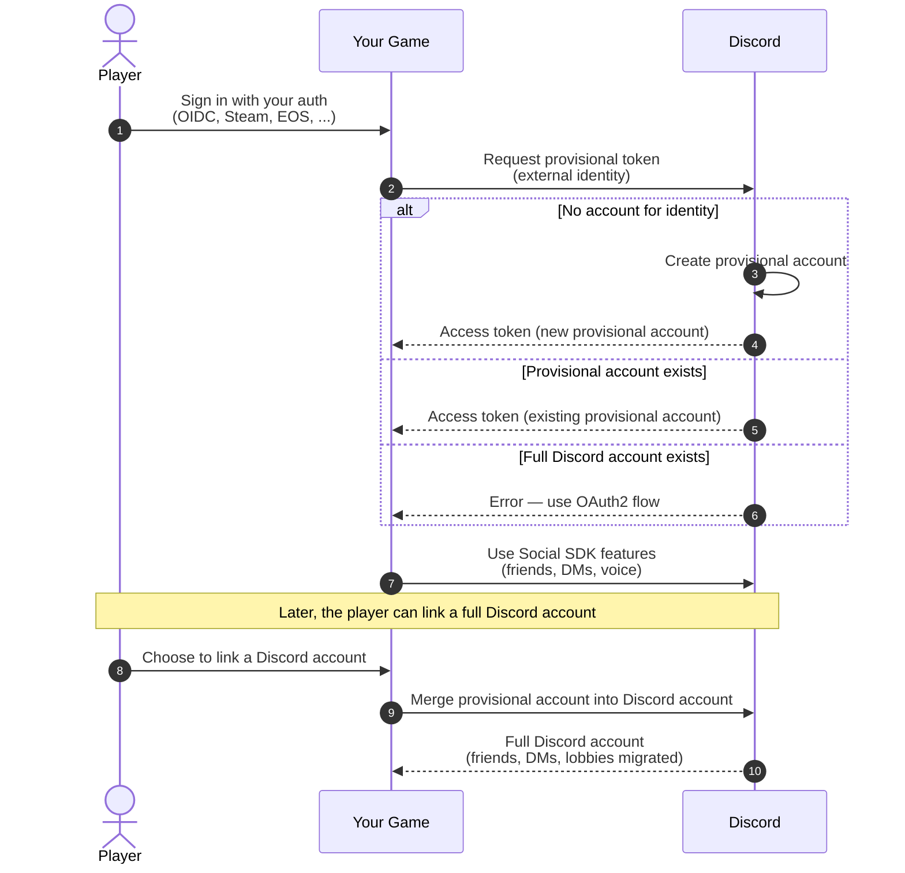

import {ManualAnchor} from '/snippets/manualanchor.jsx'
import {RobotIcon} from '/snippets/icons/RobotIcon.jsx'
import {WrenchIcon} from '/snippets/icons/WrenchIcon.jsx'
import {LinkIcon} from '/snippets/icons/LinkIcon.jsx'
import SupportCallout from '/snippets/discord-social-sdk/callouts/support.mdx';

## Overview

Provisional accounts let players use Social SDK features in your game without linking a Discord account so all players can have a consistent gameplay experience.

With provisional accounts, players can:

- Add friends and communicate with other players
- Join voice chats in game lobbies
- Send direct messages to other players
- Appear in friends lists and game lobbies

All of this works seamlessly whether your players have Discord accounts or not.

<Tip>
    Two terms show up throughout these guides: _linking_ is the player-facing action of connecting a Discord account,
    and _merging_ is the operation that carries it out — the provisional account's data is merged into the Discord
    account. They describe the same flow from different angles.
</Tip>

This section will show you how to:

1. [Choose an authentication method](#choosing-an-authentication-method) and [configure your identity provider](/developers/discord-social-sdk/development-guides/provisional-accounts/identity-providers)
2. [Create](/developers/discord-social-sdk/development-guides/provisional-accounts/bot-token-endpoint) and [manage](/developers/discord-social-sdk/development-guides/provisional-accounts/managing-accounts) provisional accounts for your game
3. [Merge](/developers/discord-social-sdk/development-guides/provisional-accounts/merging-accounts) accounts when users link a full Discord account, and [unmerge](/developers/discord-social-sdk/development-guides/provisional-accounts/unmerging-accounts) them when the link is severed

## Prerequisites

Before you begin, make sure you have:

- A basic understanding of how the SDK works from the [Getting Started Guide](/developers/discord-social-sdk/getting-started)
- An external authentication provider set up for your game

---

<ManualAnchor id="what-are-provisional-accounts" />
## What Are Provisional Accounts?

Think of provisional accounts as temporary Discord accounts that:

- Work only with your game
- Can be merged into a full Discord account later
- Persist between game sessions
- Use your game's authentication system

With provisional accounts, players can use Discord features like chat and voice and interact with game friends without creating a full Discord account. They are "placeholder" Discord accounts for the user that your game owns and manages.

For existing Discord users who have added a provisional account as a game friend, the provisional account will appear in their friend list, allowing you to send direct messages and interact with them for text and voice in lobbies.

### Benefits

- Instant Access: Players can use social features immediately
- Seamless Experience: Works the same for all players
- Easy Linking: Simple to merge into a full Discord account
- Data Persistence: Friends and history are preserved
- Cross-Platform: Works on all supported platforms

### Provisional Account Lifecycle

The diagram below shows the general lifecycle of a provisional account, from creation through an optional merge with a
full Discord account.

---

## Choosing an Authentication Method

Discord offers a number of authentication methods, the one you use depends on how your game and account system are
set up:

1. Use the [Bot Token Endpoint](/developers/discord-social-sdk/development-guides/provisional-accounts/bot-token-endpoint)
if your game has an account system which uniquely identifies users. **This is the recommended approach when possible.**
2. Use [Server Authentication with External Credentials Exchange](/developers/discord-social-sdk/development-guides/provisional-accounts/external-credentials-exchange)
if you have a hard requirement for a server side custom OIDC integration.
3. Use the [Public Client Integration](/developers/discord-social-sdk/development-guides/provisional-accounts/public-client)
method if you don't have a server authoritative backend, and therefore require using a Public Client for
authentication.

If you are using (2) or (3), you must [configure your identity provider](/developers/discord-social-sdk/development-guides/provisional-accounts/identity-providers) before being able to create provisional accounts.

## Implementing Provisional Accounts

Whichever method you choose, creating a provisional account and requesting an access token for it always happens in a single step.

You provide external authentication that uniquely identifies the user, and Discord finds a user associated with that identifier.

- If there is no account associated with the identity, a new provisional account is created along with a new access token for the user.
- If there is a provisional account associated with the identity, an access token is returned.
- If there is an existing _full Discord account_ associated with the identity, the request is aborted.

Once authentication is complete, you can use the access token as you would a full Discord user's access token.

---

## Next Steps

<CardGroup cols={3}>
  <Card title="Bot Token Endpoint" href="/developers/discord-social-sdk/development-guides/provisional-accounts/bot-token-endpoint" icon={<RobotIcon />}>
    Recommended. Create accounts from your game's own unique user IDs using your bot token.
  </Card>
  <Card title="Managing Provisional Accounts" href="/developers/discord-social-sdk/development-guides/provisional-accounts/managing-accounts" icon={<WrenchIcon />}>
    Refresh access tokens and set display names.
  </Card>
  <Card title="Merging Accounts" href="/developers/discord-social-sdk/development-guides/provisional-accounts/merging-accounts" icon={<LinkIcon />}>
    Merge a provisional account into a full Discord account.
  </Card>
</CardGroup>

<SupportCallout />

---

## Change Log

| Date           | Changes                                                   |
|----------------|-----------------------------------------------------------|
| July 14, 2026  | Split the provisional accounts guide into its own section |
| March 17, 2025 | Initial release                                           |
