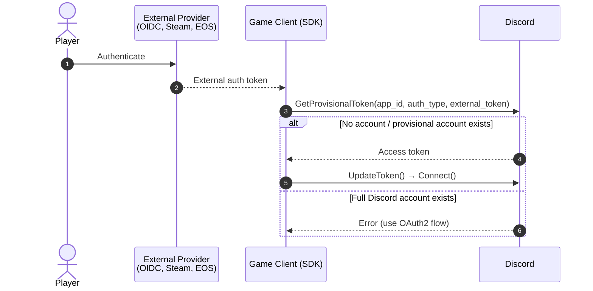

import PublicClient from '/snippets/discord-social-sdk/callouts/public-client.mdx';
import {WrenchIcon} from '/snippets/icons/WrenchIcon.jsx'
import {LinkIcon} from '/snippets/icons/LinkIcon.jsx'
import {SlashBoxIcon} from '/snippets/icons/SlashBoxIcon.jsx'
import SupportCallout from '/snippets/discord-social-sdk/callouts/support.mdx';
import ProvisionalAccountErrors from '/snippets/discord-social-sdk/partials/provisional-account-errors.mdx';
import ProvisionalAccountOidcErrors from '/snippets/discord-social-sdk/partials/provisional-account-oidc-errors.mdx';

## Authentication for Public Clients

<PublicClient />

<Warning>
Use Public Client Integration only if you don't have a server-authoritative backend and therefore require a Public Client for authentication.
</Warning>

If you have `Public Client` enabled on your Discord app, you can use the following code to authenticate your players with the external provider directly from the client — no backend required. Before using this method, you must [configure your identity provider](/developers/discord-social-sdk/development-guides/provisional-accounts/identity-providers) in the Developer Portal.

```cpp
// filepath: your_game/auth_manager.cpp
void AuthenticateUser(std::shared_ptr<discordpp::Client> client) {
    // Get your external auth token (Steam, OIDC, etc.)
    std::string externalToken = GetExternalAuthToken();

    // Get provisional token from Discord
    client->GetProvisionalToken(DISCORD_APPLICATION_ID,
        discordpp::AuthenticationExternalAuthType::OIDC,
        externalToken,
        [client](discordpp::ClientResult result, std::string accessToken, std::string refreshToken, discordpp::AuthorizationTokenType tokenType, int32_t expiresIn, std::string scope) {
        if (result.Successful()) {
            std::cout << "🔓 Provisional token received! Establishing connection...\n";
            client->UpdateToken(discordpp::AuthorizationTokenType::Bearer, accessToken, [client](discordpp::ClientResult result) {
                client->Connect();
            });
        } else {
            std::cerr << "❌ Provisional token request failed: " << result.Error() << std::endl;
        }
    });
}
```

### How the Flow Works



Once authentication is complete, you can use the access token as you would a full Discord user's access token. See [Managing Provisional Accounts](/developers/discord-social-sdk/development-guides/provisional-accounts/managing-accounts) for token refresh, storage, and display names.

## Error Handling

<ProvisionalAccountErrors />

<ProvisionalAccountOidcErrors />

---

## Next Steps

<CardGroup cols={3}>
  <Card title="Managing Provisional Accounts" href="/developers/discord-social-sdk/development-guides/provisional-accounts/managing-accounts" icon={<WrenchIcon />}>
    Refresh access tokens and set display names.
  </Card>
  <Card title="Merging Accounts" href="/developers/discord-social-sdk/development-guides/provisional-accounts/merging-accounts" icon={<LinkIcon />}>
    Merge a provisional account into a full Discord account.
  </Card>
  <Card title="Unmerging Accounts" href="/developers/discord-social-sdk/development-guides/provisional-accounts/unmerging-accounts" icon={<SlashBoxIcon />}>
    Sever the link between a Discord account and a provisional account.
  </Card>
</CardGroup>

<SupportCallout />

---

## Change Log

| Date           | Changes                                                   |
|----------------|-----------------------------------------------------------|
| July 14, 2026  | Split the provisional accounts guide into its own section |
| March 17, 2025 | Initial release                                           |
