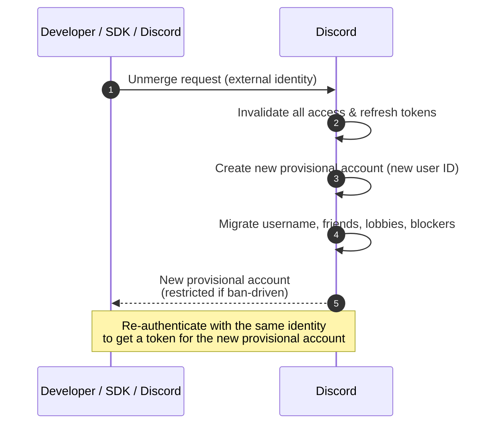

import PublicClient from '/snippets/discord-social-sdk/callouts/public-client.mdx';
import SupportCallout from '/snippets/discord-social-sdk/callouts/support.mdx';
import {LinkIcon} from '/snippets/icons/LinkIcon.jsx'
import {PaintPaletteIcon} from '/snippets/icons/PaintPaletteIcon.jsx'
import {UserPlusIcon} from '/snippets/icons/UserPlusIcon.jsx'

## Unmerging Provisional Accounts

The link between a Discord account and a provisional account can be severed in four ways:

1. The user can unmerge their account from the Discord client
2. A developer can unmerge the account using the unmerge endpoint on the Discord API
3. A developer can use the SDK helper method for public clients
4. Discord can sever the link automatically when the user's Discord account is banned — see [Ban-Driven Unmerge](#ban-driven-unmerge) below

<Warning>
Unmerging invalidates all access/refresh tokens for the user. They cannot be used again after the unmerge operation completes. Any connected game sessions will be disconnected.
</Warning>

<Tip>
    Unmerging does not affect the external identity you used to create the provisional account —
    your `external_user_id` (for the [Bot Token Endpoint](/developers/discord-social-sdk/development-guides/provisional-accounts/bot-token-endpoint)),
    or your `external_auth_token`
    (for OIDC, Steam, EOS, and other credential-exchange providers). After the unmerge completes, you can
    re-authenticate with that same identity to retrieve the token for the newly created provisional account.
</Tip>

### How Unmerging Works

Every unmerge — whether developer-initiated, user-initiated, or ban-driven — invalidates the user's tokens and creates a fresh provisional account for the same external identity.



---

## Unmerging Provisional Accounts Server-Side

A developer can unmerge a user's account by sending a request to the unmerge endpoint on the Discord API. The endpoint and identifier you use depend on how the provisional account was created.

<Info>
If you have a server backend, you'll want to use the server-to-server unmerge endpoint rather than the SDK helper method to maintain better security and control over the unmerge process.
</Info>

### Unmerging with Bot Token Endpoint

If you created the provisional account with the [Bot Token Endpoint](/developers/discord-social-sdk/development-guides/provisional-accounts/bot-token-endpoint), you can unmerge accounts without an external auth token — identify the account by the same `external_user_id` you used to create it.

```python
import requests

API_ENDPOINT = 'https://discord.com/api/v10'
BOT_TOKEN = 'YOUR_BOT_TOKEN'

def unmerge_provisional_account(external_user_id):
  data = {
    'external_user_id': external_user_id # identifier used in the /token/bot endpoint
  }
  headers = {
    'Content-Type': 'application/json',
    'Authorization': f'Bot {BOT_TOKEN}'
  }
  r = requests.post('%s/partner-sdk/provisional-accounts/unmerge/bot' % API_ENDPOINT, json=data, headers=headers)
  r.raise_for_status()
```

<Tip>
This endpoint can also be useful in cases where the Discord Auth token has been lost to error or data loss, and an unmerge operation is required to migrate to a provisional account before re-linking a Discord account.
</Tip>

### Unmerging with External Credentials

If you created the provisional account through [External Credentials Exchange](/developers/discord-social-sdk/development-guides/provisional-accounts/external-credentials-exchange) (OIDC, Steam, EOS, and so on), send the same `external_auth_type` and `external_auth_token` you used to create it to the unmerge endpoint.

```python
import requests

API_ENDPOINT = 'https://discord.com/api/v10'
CLIENT_ID = '332269999912132097'
CLIENT_SECRET = '937it3ow87i4ery69876wqire'
EXTERNAL_AUTH_TYPE = 'OIDC'

def unmerge_provisional_account(external_auth_token):
  data = {
    'client_id': CLIENT_ID,
    'client_secret': CLIENT_SECRET,
    'external_auth_type': EXTERNAL_AUTH_TYPE,
    'external_auth_token': external_auth_token
  }
  r = requests.post('%s/partner-sdk/provisional-accounts/unmerge' % API_ENDPOINT, json=data, headers=headers)
  r.raise_for_status()
```

---

## Unmerging Provisional Accounts for Public Clients

<PublicClient />

The quickest way to unmerge accounts is to leverage the [`Client::UnmergeIntoProvisionalAccount`] method,
which will handle the entire process for you. This method is designed for public clients that don't have a backend server.

**Important Notes:**
- This function only works for **public clients** (applications without backend servers)
- You'll need to enable "Public Client" on your Discord application's OAuth2 tab in the Discord developer portal
- After unmerging, you should use [`Client::GetProvisionalToken`] to get a new provisional token for the newly created provisional account

```cpp
// unmerge a user account
void UnmergeUserAccount(const std::shared_ptr<discordpp::Client>& client) {
    // Get your external auth token (Steam, OIDC, etc.)
    std::string externalToken = GetExternalAuthToken();

    // Unmerge the Discord account from the external identity
    client->UnmergeIntoProvisionalAccount(
        YOUR_DISCORD_APPLICATION_ID,
        discordpp::AuthenticationExternalAuthType::OIDC, // or STEAM, EOS, etc.
        externalToken,
        [client, externalToken](const discordpp::ClientResult &result) {
            if (result.Successful()) {
                std::cout << "✅ Account unmerged successfully! Creating new provisional account...\n";

                // Now get a new provisional token for the unlinked identity
                client->GetProvisionalToken(
                    YOUR_DISCORD_APPLICATION_ID,
                    discordpp::AuthenticationExternalAuthType::OIDC,
                    externalToken,
                    [client](const discordpp::ClientResult &result,
                                 const std::string &accessToken,
                                                     const std::string& refreshToken,
                                                     discordpp::AuthorizationTokenType tokenType,
                                                     int32_t expiresIn,
                                                     const std::string& scopes) {
                        if (result.Successful()) {
                            std::cout << "🔓 New provisional account created! Establishing connection...\n";
                            client->UpdateToken(discordpp::AuthorizationTokenType::Bearer, accessToken,
                                [client](const discordpp::ClientResult &updateResult) {
                                    if (updateResult.Successful()) {
                                        client->Connect();
                                    } else {
                                        std::cerr << "❌ Failed to update token: " << updateResult.Error() << std::endl;
                                    }
                                }
                            );
                        } else {
                            std::cerr << "❌ Failed to create new provisional account: " << result.Error() << std::endl;
                        }
                    }
                );
            } else {
                std::cerr << "❌ Unmerge failed: " << result.Error() << std::endl;
            }
        }
    );
}
```

---

## Out-of-Band Unmerge

The link can also be severed without your code calling any unmerge endpoint:

- **User-initiated**: the user removes your app from their Discord `User Settings -> Authorized Apps` page. The result is a standard unmerge — the user can re-link freely later.
- **Ban-driven**: when the user's Discord account is banned by Discord, the link is severed automatically. This is mechanically an unmerge, but with additional lifecycle consequences — see [Ban-Driven Unmerge](#ban-driven-unmerge) below.

In both cases your app observes the same auth-side signals — an `APPLICATION_DEAUTHORIZED` webhook fires and stored tokens are invalidated. See [Out-of-Band Revocation](/developers/discord-social-sdk/development-guides/account-linking-with-discord#out-of-band-revocation) in the Account Linking guide for the details and recommended recovery path.

These paths don't require any code changes from you, but we recommend providing an in-app unmerge option through one of the methods above for a better user experience.

### Ban-Driven Unmerge

When a player's Discord account is banned (temporarily or permanently), Discord performs an unmerge automatically. Two things happen:

1. **OAuth2 tokens are deleted immediately** — producing the same `APPLICATION_DEAUTHORIZED` webhook and `invalid_grant`-on-refresh signals as any out-of-band revocation. There is no grace period.
2. **A new provisional account is created for the same external identity.** Standard [unmerge data migration](#data-migration-during-unmerging) applies — username, friends list, lobbies, and so on are preserved — so the player retains their in-game social graph even though their Discord identity is gone. The new provisional account is created in a **restricted** state.

While the new provisional account is restricted:

- It **cannot be merged** into a different Discord account. Any merge attempt via [`/oauth2/token` with `external_auth_token`](/developers/discord-social-sdk/development-guides/provisional-accounts/merging-accounts#merging-provisional-accounts-for-servers) will fail with error [`530017` "Merge source user is banned"](/developers/discord-social-sdk/development-guides/provisional-accounts/merging-accounts#merge-request-failures).
- For a **temporary ban**, the restriction lifts automatically when the ban expires, and the provisional account can then be merged again.
- For a **permanent ban**, the restriction stays in place indefinitely.

<Info>
There is no API to look up whether a player's Discord account is currently banned. In practice, the combination of
    `APPLICATION_DEAUTHORIZED` and/or `invalid_grant`-on-refresh is the signal you should fall
    back to the [provisional account flow](/developers/discord-social-sdk/development-guides/provisional-accounts/overview#implementing-provisional-accounts).
</Info>

---

## Data Migration During Unmerging

<Note>
This is the reverse of [merging](/developers/discord-social-sdk/development-guides/provisional-accounts/merging-accounts#data-migration-during-merging), and the two are not symmetric. Merging moves the provisional account's data **onto the existing full Discord account**, so DM history is preserved. Unmerging instead creates a **brand-new provisional account**, and DM history is **not** carried over to it.
</Note>

When a user unmerges their account, a new provisional account is created with a new user ID.
The following data is transferred to the new provisional account asynchronously:

* **✅ Username**: Global name is copied to the new provisional account
* **✅ In-game friends**: All copied to the new provisional account
* **✅ Discord friends who use this application**: Copied to the provisional account
* **✅ Blockers**: Accounts that blocked the original Discord account are preserved
* **✅ Lobbies**: Active lobby memberships for the application are transferred

The following data is **not** transferred:

* **❌ Discord friends who don't use this application**: Not transferred
* **❌ DM message history**: Not moved to provisional accounts

<Info>
Provisional accounts can have Discord friends, but can only message these friends when actively playing the game.
</Info>

---

## Unmerge Request Failures

You may receive an unmerge specific error code while attempting this operation:

| Code  | HTTP Status | Meaning           | Solution                                                  |
|-------|-------------|-------------------|-----------------------------------------------------------|
| 50229 | 400         | Invalid user type | User account is provisional and cannot be unmerged        |
| -     | 404         | Unknown user      | No user identity found for the provided external identity |

---

## Next Steps

<CardGroup cols={3}>
  <Card title="Merging Accounts" href="/developers/discord-social-sdk/development-guides/provisional-accounts/merging-accounts" icon={<LinkIcon />}>
    Merge a provisional account into a full Discord account.
  </Card>
  <Card title="Designing for Provisional Accounts" href="/developers/discord-social-sdk/design-guidelines/provisional-accounts" icon={<PaintPaletteIcon />}>
    Design guidelines for implementing provisional accounts in your game.
  </Card>
  <Card title="Account Linking from Your Game" href="/developers/discord-social-sdk/development-guides/account-linking-with-discord" icon={<UserPlusIcon />}>
    The standard OAuth2 flow for players who already have a Discord account.
  </Card>
</CardGroup>

<SupportCallout />

---

## Change Log

| Date           | Changes                                                   |
|----------------|-----------------------------------------------------------|
| July 14, 2026  | Split the provisional accounts guide into its own section |
| March 17, 2025 | Initial release                                           |

{/* Autogenerated Reference Links */}
[`Client::GetProvisionalToken`]: https://discord.com/developers/docs/social-sdk/classdiscordpp_1_1Client.html#a8003130b6c46e54ac68442483bf0480c
[`Client::UnmergeIntoProvisionalAccount`]: https://discord.com/developers/docs/social-sdk/classdiscordpp_1_1Client.html#a2da21ae8a3015e0e5e42c1a7226b256f