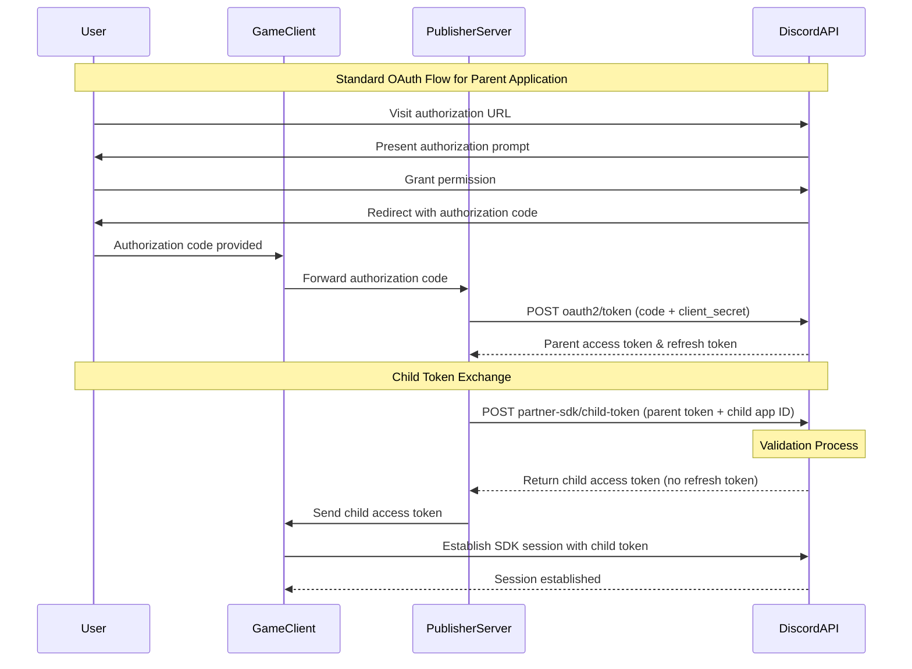
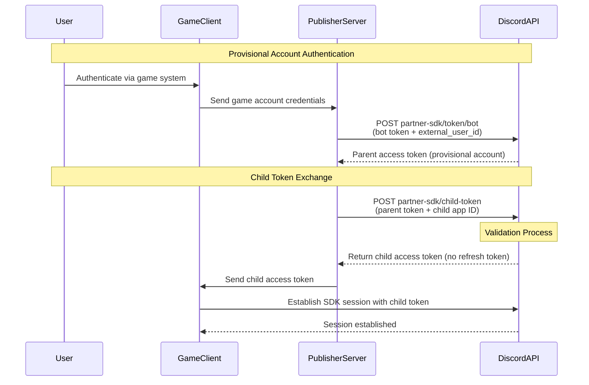

import SupportCallout from '/snippets/discord-social-sdk/callouts/support.mdx';

<Note>
Publisher Level Account Linking requires Discord approval.

To inquire about access, speak to your Discord account representative or [contact us](https://discord.com/developers/contact-us)
</Note>

## Overview

Publisher Level Account Linking enables a developer with multiple games to have a single
authorization flow across all games in their portfolio. Players authenticate through a publisher application
instead of authenticating separately for each game.

This is done by establishing a parent-child application hierarchy between the publisher
application (parent), and game applications (children).

Once established, the publisher application can then perform player authentication, and its game
application can be used to connect and utilize the Discord Social SDK.

This guide will show you how to:

- Set up publisher and game applications
- Exchange parent tokens for child tokens
- Use child tokens with the Discord Social SDK
- Understand token lifecycle and limitations

## Benefits

### For Publishers
- **Centralized Account Management**: Manage user authorization at the publisher level

### For Players
- **Simplified Experience**: Reduced friction when playing multiple games from the same publisher
- **Richer Social Features**: Access enriched friend data and activity across the publisher's game catalog

---

## How It Works

The Publisher Authentication system uses two types of applications:

1. **Publisher application (parent)**: Executes OAuth2 account linking and manages user authorization
2. **Game application (child)**: Uses child access tokens obtained from the parent for Social SDK operations

The flow works as follows:

1. User authenticates once through the publisher application using standard OAuth2
2. Developer exchanges the parent access token for a child access token using the `/partner-sdk/child-token` endpoint
3. Child token is used to initialize the Discord Social SDK for the specific game
4. All Social SDK operations are now performed with the child token

We can view this as a table to see which responsibilities lie with the Publisher application and which lie with the
game application:

| **Action**                                      | **Publisher Application (Parent)** | **Game Application (Child)** |
|-------------------------------------------------|:----------------------------------:|:----------------------------:|
| Discord account authentication                  |                 ✅                  |              ❌               |
| Provisional account authentication              |                 ✅                  |              ❌               |
| Issues parent access tokens with refresh tokens |                 ✅                  |              ❌               |
| Exchange parent tokens for child token          |                 ✅                  |              ❌               |
| Used to connect to Social SDK                   |                 ❌                  |              ✅               |
| Operates in context of specific game            |                 ❌                  |              ✅               |

---

## Prerequisites

Before you begin, make sure you have:

- A Discord application configured as the publisher (parent) with OAuth2 enabled
- One or more Discord applications configured as games (children)
- Social SDK integration enabled for all applications
- Contact with Discord to establish the parent-child relationships between applications

---

## Application Configuration

### 1. Configure the Publisher Application

Set up your publisher application following the standard [OAuth2 guidelines](/developers/discord-social-sdk/development-guides/account-linking-with-discord):

1. Navigate to the [Developer Portal](https://discord.com/developers/applications)
2. Select your publisher application
3. Configure OAuth2 redirect URIs on the OAuth2 settings page
4. Enable the Social SDK integration
5. Note your Client ID and Client Secret

### 2. Configure Game Applications

For each game application:

1. Create a new application in the [Developer Portal](https://discord.com/developers/applications)
2. Enable Social SDK integration
3. **Do not configure OAuth2 redirect URIs** - game applications don't need them
4. Note the application's Client ID

<Info>
Game applications do not require OAuth2 configuration since they use child tokens obtained from the parent application.
</Info>

### 3. Establish Parent-Child Relationships

<Warning>You will need to contact Discord to link your game applications to your publisher application.</Warning>

To link child game applications to the parent publisher application, provide Discord with the following:
- Parent application ID (publisher)
- Child application IDs (games)

Discord will configure the relationships in their systems to enable token exchange.

<Warning>
    Publisher applications and game applications are restricted from certain actions once the parent-child relationship
    is established.

    If existing applications are being migrated to either publisher or game applications, some flows may be broken as
    soon as the relationship is configured. We recommend discussing this with Discord before initiating the
    migration.

    Alternatively, create new applications for both publisher and game applications as part of implementing Publisher
    Level Account Linking.
</Warning>

When you establish a link, the child application has the following data deleted:

| **Data Type**               | **Action**                                            |
|-----------------------------|-------------------------------------------------------|
| OAuth2 tokens               | All tokens for the child app are deleted              |
| Lobbies                     | All lobbies associated with the child app are deleted |
| User Application Identities | Deleted for all users                                 |
| Provisional accounts        | All provisional users are deleted                     |
| Game Relationships          | Removed for all users associated with the app         |

The parent application is unaffected - existing tokens remain valid since they can still be used in normal OAuth2 flows.

### 4. Match Confidentiality Settings

Ensure that child applications match the confidentiality setting of the parent application:

- If the parent is a **confidential client** (has a client secret), all children must be confidential clients
- If the parent is a **public client**, all children must be public clients

---

## Implementing Token Exchange

Publisher Level Account Linking supports both provisional accounts for users without Discord accounts and standard
OAuth2 for users with linked Discord accounts.

### Linked Discord Account Flow



### Provisional Account Flow



### Obtaining the Parent Access Token

Before you can exchange tokens, you must first obtain a parent access token through Discord OAuth2 authorization, or
provisional account authorization using the **publisher application ID**.

When performing authorization with publisher level account linking, always use the publisher application ID for
all authentication operations.

<Warning>
OAuth2 and Provisional account calls using child (game) application IDs will fail. Only the publisher application
can be used for user authorization.
</Warning>

Follow the standard [Account Linking with Discord](/developers/discord-social-sdk/development-guides/account-linking-with-discord)
or [Using Provisional Accounts](/developers/discord-social-sdk/development-guides/using-provisional-accounts)
flow, using your publisher application id. This will provide you with a parent access token and refresh token.

### Exchanging Parent Token for Child Token

Once you have a parent access token from the OAuth2 flow, exchange it for a child token using the `/partner-sdk/child-token` endpoint.

<Info>
**Important Token Usage Restrictions**

Parent access tokens cannot be used to connect to Discord via the Social SDK - **only** child access tokens can<br/>
Child applications cannot be used for OAuth2 account linking flows - child access tokens can **only** be acquired through the token exchange flow<br/>
When making direct calls to Discord server APIs, use the child access token for Bearer authorization<br/>
</Info>

#### Exchange for Child Token

```python
import requests

API_ENDPOINT = 'https://discord.com/api/v10'
PARENT_ACCESS_TOKEN = 'parent_token_here'
CHILD_APPLICATION_ID = '987654321098765432'
PARENT_CLIENT_SECRET = 'your_parent_client_secret'

def exchange_for_child_token(parent_token, child_app_id, parent_client_secret):
    response = requests.post(
        f'{API_ENDPOINT}/partner-sdk/child-token',
        headers={
            'Content-Type': 'application/json'
        },
        json={
            'parent_access_token': parent_token,
            'child_application_id': child_app_id,
            'parent_client_secret': parent_client_secret
        }
    )
    response.raise_for_status()
    return response.json()

# Exchange the token
child_token_data = exchange_for_child_token(
    PARENT_ACCESS_TOKEN,
    CHILD_APPLICATION_ID,
    PARENT_CLIENT_SECRET
)

print(f"Child access token: {child_token_data['access_token']}")
print(f"Expires in: {child_token_data['expires_in']} seconds")
```

#### Token Exchange Response

```json
{
  "access_token": "child_application_access_token",
  "token_type": "Bearer",
  "expires_in": 604800,
  "scope": "sdk.social_layer"
}
```

### Response Fields

| Field          | Description                                                |
|----------------|------------------------------------------------------------|
| `access_token` | The child access token to use with the Social SDK          |
| `token_type`   | Always "Bearer"                                            |
| `expires_in`   | Token expiry time in seconds (matches parent token expiry) |
| `scope`        | OAuth2 scopes for the token                                |

<Warning>
No refresh token is returned from the child token endpoint. When you need a new child token, re-exchange using the parent token.
</Warning>

---

## Integrating with the Social SDK

After completing the backend token exchange, you need to integrate the child token into your game client's Social SDK. This section covers how to configure the SDK to work with publisher authentication.

### Use the Publisher Application ID for Authorization

When your game needs to initiate authorization, always use the **publisher application ID**, not the game application ID:

```cpp
// Use the PUBLISHER_APPLICATION_ID for authorization
discordpp::AuthorizationArgs args{};
args.SetClientId(PUBLISHER_APPLICATION_ID);  // Parent app ID, not child
args.SetScopes(discordpp::Client::GetDefaultPresenceScopes());

client->Authorize(args, [](discordpp::ClientResult result, std::string code, std::string redirectUri) {
    if (result.Successful()) {
        std::cout << "✅ Authorization successful!" << std::endl;
        // Exchange code for parent token, then exchange parent token for child token
    }
});
```

### Connect the SDK with the Child Token

Once your backend provides the child token, use it to authenticate the Social SDK:

```cpp
#include <discord-social-sdk/discord.h>

void InitializeSDKWithChildToken(const std::string& childAccessToken) {
    // Create SDK client instance
    auto client = std::make_shared<discordpp::Client>();

    // Update the client with the child token
    client->UpdateToken(
        discordpp::AuthorizationTokenType::Bearer,
        childAccessToken,
        [client](discordpp::ClientResult result) {
            if (result.Successful()) {
                std::cout << "✅ Token updated successfully!" << std::endl;

                // Connect to Discord
                client->Connect();
            } else {
                std::cerr << "❌ Failed to update token: " << result.Error() << std::endl;
            }
        }
    );
}
```

Once connected, all Social SDK operations execute in the context of the game (child) application.

---

## Token Lifecycles

Child game application token lifecycles are directly tied to their parent publisher application tokens. Understanding how game tokens behave when publisher tokens are refreshed or revoked is essential for implementing your integration correctly.

### Token Expiration
Game token expirations are tied to their parent publisher tokens:

- Game tokens expire at the **same time** as the publisher token
- Game token `expires_in` matches the publisher token's remaining lifetime
- No refresh tokens are provided for game tokens

### Publisher Token Refresh
When publisher application tokens are refreshed:

- Existing game tokens remain valid
- Game tokens will still expire at the original publisher token expiry time
- To get a new game token with updated expiry, re-exchange using the refreshed publisher token

### Publisher Token Revoked
When publisher application tokens are revoked:
- All associated child game tokens are immediately invalidated
- Any active SDK sessions using game tokens will be disconnected

---

## Revoking Access Tokens

When revoking tokens in a publisher-level account linking setup, it's important to understand which application ID to use for revocation.

### Token Issuance vs. Revocation

While game tokens are issued through the publisher application's authority, revocation follows a different pattern:

- **Game tokens are issued by the publisher application** - The `/partner-sdk/child-token` endpoint uses the publisher application's credentials to issue game tokens
- **Revocation uses the token's associated application ID**:
  - **Publisher token revocation** → Use the **parent publisher application ID**
  - **Game token revocation** → Use the **child game application ID**

<Info>
When revoking a token, always use the application ID that the token represents, not the application ID that issued it.
</Info>

### Revoking Publisher Tokens

To revoke a publisher access token, use the publisher application ID and credentials:

```python
import requests

API_ENDPOINT = 'https://discord.com/api/v10'
PARENT_CLIENT_ID = 'YOUR_PARENT_CLIENT_ID'
PARENT_CLIENT_SECRET = 'YOUR_PARENT_CLIENT_SECRET'

def revoke_parent_token(parent_token):
    data = {'token': parent_token}
    headers = {'Content-Type': 'application/x-www-form-urlencoded'}
    r = requests.post(
        f'{API_ENDPOINT}/oauth2/token/revoke',
        data=data,
        headers=headers,
        auth=(PARENT_CLIENT_ID, PARENT_CLIENT_SECRET)
    )
    r.raise_for_status()
```

<Warning>
Revoking a publisher token will invalidate all publisher access and refresh tokens for that user, and will also **immediately invalidate all associated game tokens**. Any active SDK sessions using game tokens will be disconnected.
</Warning>

### Revoking Game Tokens

To revoke a game access token, use the game application ID and credentials:

```python
import requests

API_ENDPOINT = 'https://discord.com/api/v10'
CHILD_CLIENT_ID = 'YOUR_CHILD_CLIENT_ID'
CHILD_CLIENT_SECRET = 'YOUR_CHILD_CLIENT_SECRET'

def revoke_child_token(child_token):
    data = {'token': child_token}
    headers = {'Content-Type': 'application/x-www-form-urlencoded'}
    r = requests.post(
        f'{API_ENDPOINT}/oauth2/token/revoke',
        data=data,
        headers=headers,
        auth=(CHILD_CLIENT_ID, CHILD_CLIENT_SECRET)
    )
    r.raise_for_status()
```

For more details on the token revocation API and additional options, see [Revoking Access Tokens](/developers/discord-social-sdk/development-guides/account-linking-with-discord#revoking-access-tokens) in the Account Linking guide.

---

## Next Steps

Now that you've set up publisher level account linking, explore more features of the Discord Social SDK:

import {ListViewIcon} from '/snippets/icons/ListViewIcon.jsx'
import {UserStatusIcon} from '/snippets/icons/UserStatusIcon.jsx'
import {DoorEnterIcon} from '/snippets/icons/DoorEnterIcon.jsx'

<CardGroup cols={3}>
    <Card title="Creating a Unified Friends List" href="/developers/discord-social-sdk/development-guides/creating-a-unified-friends-list" icon={<ListViewIcon />}>
        Combine Discord and game friends into a single list for easy management.
    </Card>
    <Card title="Setting Rich Presence" href="/developers/discord-social-sdk/development-guides/setting-rich-presence" icon={<UserStatusIcon />}>
        Display game status and information to Discord friends.
    </Card>
    <Card title="Managing Lobbies" href="/developers/discord-social-sdk/design-guidelines/provisional-accounts" icon={<DoorEnterIcon />}>
        Bring players together in a shared lobby with invites, text chat, and voice comms.
    </Card>
</CardGroup>

<SupportCallout />

---

## Change Log

| Date              | Changes         |
|-------------------|-----------------|
| Febraury 18, 2026 | Initial release |
