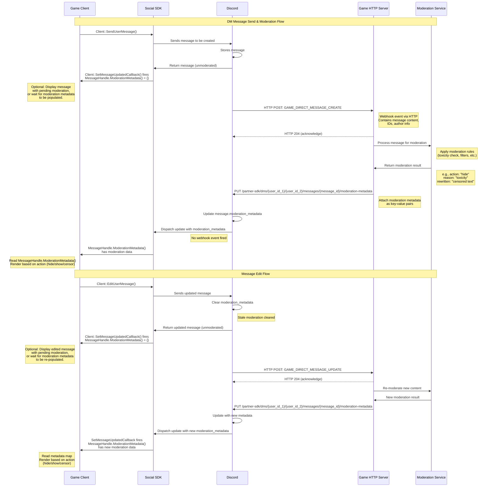
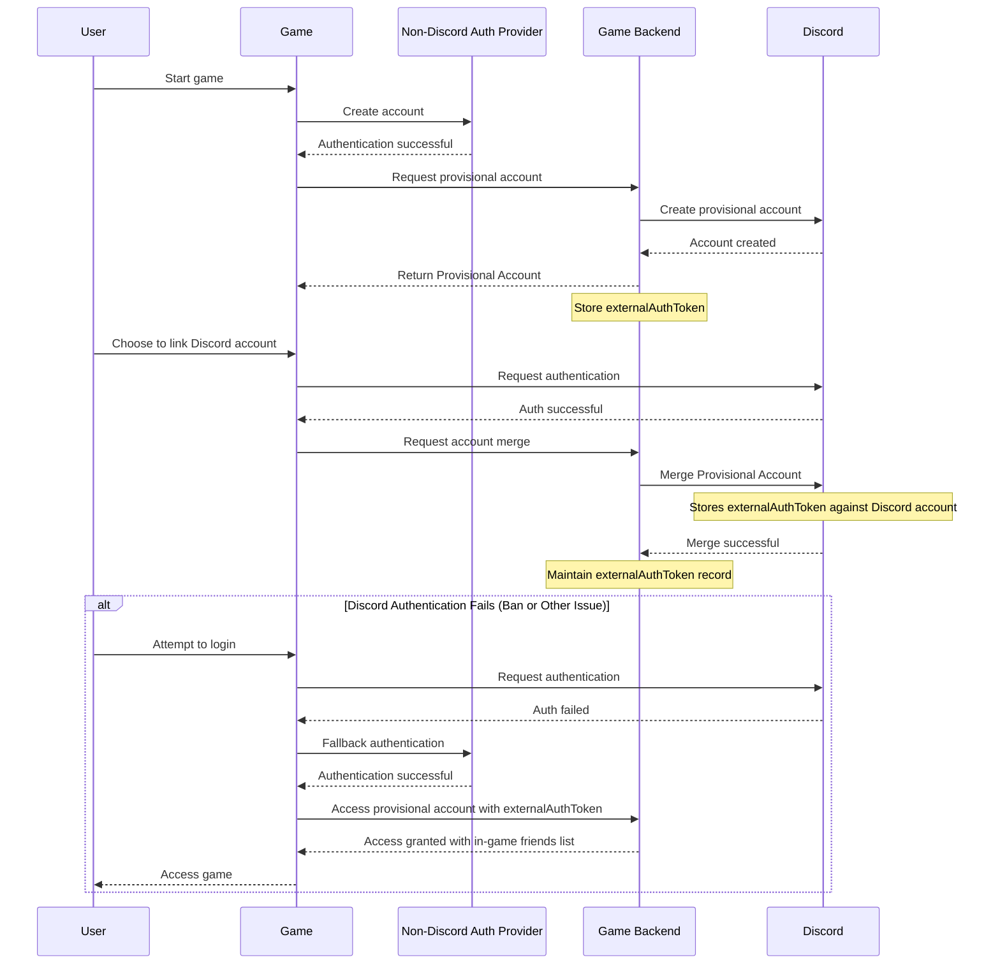

import PublicClient from '/snippets/discord-social-sdk/callouts/public-client.mdx';
import SupportCallout from '/snippets/discord-social-sdk/callouts/support.mdx';

This guide will walk you through integrating and managing content moderation for your game when using the Discord Social SDK.

## Overview

Effective moderation is essential for creating healthy social experiences. This guide will help you:

- Better understand your moderation responsibilities
- Implement server-side moderation for text content using Discord's moderation metadata API
- Implement client-side moderation for audio content with the Discord Social SDK

## Prerequisites

Before you begin, make sure you have:

- A basic understanding of how the SDK works from the [Getting Started Guide](/developers/discord-social-sdk/getting-started)
- A basic understanding of your game's communication features
- Familiarity with [provisional accounts](/developers/discord-social-sdk/development-guides/using-provisional-accounts)
- Reviewed the [Discord Social SDK Terms](https://support-dev.discord.com/hc/en-us/articles/30225844245271-Discord-Social-SDK-Terms)

## Your Moderation Responsibilities

### Moderation on Discord

[Discord's Community Guidelines](https://discord.com/guidelines) and [Terms of Service](https://discord.com/terms) apply to any content that is rendered on Discord, including:

- Text messages, audio, and video sent within Discord's platform
- Text messages that are appear on Discord (such as in DMs or Linked Channels) after being sent by players in your game (whether they have linked their Discord account or are using a provisional account)

Discord can take various actions against such content on Discord for violating its terms or policies, including through Discord platform-wide account bans and restrictions. Actions against a player's Discord account will not affect their separate account in the game (see [below](#handling-users-with-banned-discord-accounts) for more details); however, if a player's Discord account is banned, they will no longer have access to the SDK features that require an account connection.

### Game Developer's Responsibility

Your terms and policies apply to the content in your game. You are responsible for:

- Ensuring you comply with the [Discord Social SDK Terms](https://support-dev.discord.com/hc/en-us/articles/30225844245271-Discord-Social-SDK-Terms)
- Creating game-specific content policies and enforcing them
- In-game content moderation for messages or audio within your game
- Implementing appropriate UIs for reporting and moderation; this includes providing players a way to report issues or violations of your policies and reviewing and taking appropriate action on such reports

<Warning>
As a reminder, you are responsible for any third-party moderation toolkits or services you use for your game and will ensure you comply with any applicable terms and laws, including obtaining consents from players as necessary for processing their data using such moderation services.
</Warning>

## Server-Side Chat Moderation

Discord's moderation metadata API lets your backend evaluate messages and attach application scoped
`moderation_metadata` to them. The metadata is persisted by Discord and delivered to active game
sessions via realtime `GAME_DIRECT_MESSAGE_UPDATE` or `LOBBY_MESSAGE_UPDATE` [Webhook Events](/developers/events/webhook-events) — no polling required. Metadata is never exposed to
other applications and is not included in webhook events.

### How It Works

1. Your backend receives a webhook event when a message is created or updated.
2. Your moderation system evaluates the message and updates the `moderation_metadata` on the message via the Discord
API to indicate what action should be taken (hide, blur, replace, etc.).
3. Discord persists the metadata and dispatches an update event to relevant game client participants via the Social SDK.
4. The Game client is notified of the update via [`Client::SetMessageUpdatedCallback`], and retrieves the
[`MessageHandle::ModerationMetadata`] from specified [`MessageHandle`] in the firing callback, and renders the message accordingly.
5. If the message content is edited, Discord clears the moderation metadata before dispatching a new update,
indicating the message needs to be re-moderated.



<Tip>
    You may wish to implement moderation caching on your backend to avoid redundant validation. This is especially true for
    lobby messages, which are sent to multiple recipients.
</Tip>

<Info>
While this sequence diagram demonstrates moderation for direct messaging, the same flow applies to to lobby messages.
See below for the appropriate Social SDK methods, Webhook Event types and API paths to use instead.
</Info>

### Webhook Events

The first thing you will need to do is [subscribe to the following events](/developers/events/webhook-events#subscribing-to-events)
on your app's webhook to receive messages for moderation:

| Event                        | Description                                          |
|------------------------------|------------------------------------------------------|
| `GAME_DIRECT_MESSAGE_CREATE` | Fired when a DM is created in a Social SDK session   |
| `GAME_DIRECT_MESSAGE_UPDATE` | Fired when a DM is updated (content edit)            |
| `LOBBY_MESSAGE_CREATE`       | Fired when a message is created in a lobby           |
| `LOBBY_MESSAGE_UPDATE`       | Fired when a lobby message is updated (content edit) |

See the [Webhook Events reference](/developers/events/webhook-events) for full event schemas.

<Info>
Metadata-only updates do **not** fire webhook events — they are delivered only via realtime SDK
callbacks to active game sessions.
</Info>

### Applying Moderation Decisions

Once your moderation backend receives and evaluates a message, apply the decision by updating the `moderation_metadata`
on the message to indicate what action the game client should take with the content.

#### DM Messages

`user_id_1` and `user_id_2` are the two DM participants; order does not matter.

```python
import requests

API_ENDPOINT = 'https://discord.com/api/v10'
BOT_TOKEN = 'YOUR_BOT_TOKEN'

def apply_dm_moderation(user_id_1, user_id_2, message_id, metadata):
  r = requests.put(
    f'{API_ENDPOINT}/partner-sdk/dms/{user_id_1}/{user_id_2}/messages/{message_id}/moderation-metadata',
    headers={
      'Authorization': f'Bot {BOT_TOKEN}',
      'Content-Type': 'application/json',
    },
    json=metadata
  )
  r.raise_for_status()

# Instruct the client to hide this message — moderation service flagged it as toxic
metadata = {
  'action': 'hide',   # client will not render this message
  'reason': 'toxicity',  # logged by the client for reporting purposes
}
apply_dm_moderation(user_id_1, user_id_2, message_id, metadata)

# Alternatively, instruct the client to show this message — moderation service approved it
metadata = {
  'action': 'show',  # client will render the message normally
}
apply_dm_moderation(user_id_1, user_id_2, message_id, metadata)
```

#### Lobby Messages

```python
import requests

API_ENDPOINT = 'https://discord.com/api/v10'
BOT_TOKEN = 'YOUR_BOT_TOKEN'

def apply_lobby_moderation(lobby_id, message_id, metadata):
  r = requests.put(
    f'{API_ENDPOINT}/lobbies/{lobby_id}/messages/{message_id}/moderation-metadata',
    headers={
      'Authorization': f'Bot {BOT_TOKEN}',
      'Content-Type': 'application/json',
    },
    json=metadata
  )
  r.raise_for_status()

# Instruct the client to replace the message content with a policy reminder
metadata = {
  'action': 'replace',  # client will display replacement text instead of the original
  'replacement': 'Be kind to others!',  # the text the client will render in place of the message
}
apply_lobby_moderation(lobby_id, message_id, metadata)
```

<Info>
Both endpoints return `HTTP 204: No Content` on success.
</Info>

### Moderation Metadata Fields

The metadata body is a free-form key–value map. Use any keys your client understands.
Some common conventions might include:

| Key           | Example values                    | Purpose                                         |
|---------------|-----------------------------------|-------------------------------------------------|
| `action`      | `hide`, `show`, `blur`, `replace` | How the client should render the message        |
| `reason`      | `toxicity`, `spam`                | Why the action was taken (useful for logging)   |
| `replacement` | any string                        | Text to display instead of the original message |
| `severity`    | `low`, `medium`, `high`           | Optional severity classification                |

**Limits:** Up to 5 keys per message; key length ≤ 1024 characters; value length ≤ 2000 characters (the maximum
Discord message length, so values can contain modified message content).

<Info>
    Moderation metadata is application scoped — only your application can read it, even for messages that are visible in
    Discord.
</Info>


### Handling Moderation Metadata on the Client

Register [`Client::SetMessageUpdatedCallback`] to receive metadata updates. Access the metadata
through [`MessageHandle::ModerationMetadata`], which returns the key–value map written by your backend.

```cpp
client->SetMessageUpdatedCallback([&client](uint64_t messageId) {
    if (auto message = client->GetMessageHandle(messageId)) {
        auto metadata = message->ModerationMetadata();
        if (metadata.empty()) {
            // No moderation decision yet — render as pending, normally, or hide completely,
            // depending on your moderation requirements
            renderPendingModeration(message);
            return;
        }
        auto action = metadata.count("action") ? metadata.at("action") : "show";
        if (action == "hide") {
            hideMessage(messageId);
        } else if (action == "show") {
            renderMessage(message);
        } else if (action == "replace") {
            renderMessage(messageId, metadata.at("replacement"));
        } else if (action == "blur") {
            renderBlurred(message);
        } else {
            std::cerr << "Unknown moderation action: " << action << "\n";
            renderMessage(message);  // fall back to rendering normally
        }
    }
});
```

<Info>
    While moderation is in progress, consider not rendering new messages, or rendering in a "pending moderation"
    state to avoid briefly displaying unmoderated content.
</Info>

### Handling Content Edits

When a message is edited, Discord automatically clears the stored `moderation_metadata` and
dispatches a new update notification for the message.

The [`Client::SetMessageUpdatedCallback`] will fire with an empty metadata map for the edited message, and
your backend will receive a `GAME_DIRECT_MESSAGE_UPDATE` or `LOBBY_MESSAGE_UPDATE` webhook
event for the edit, which you can use to trigger re-moderation of the new content.

<Info>
    While re-moderation is in progress, consider not rendering the new, updated message, or rendering in a "pending
    moderation" state to avoid briefly displaying unmoderated content.
</Info>

## Handling Users with Banned Discord Accounts

### Discord Platform Bans

<Info>
If a player has connected their Discord account with your game, and it is banned, their [`Client`] will be
immediately disconnected, and that user will no longer be able to authenticate through Discord.
</Info>

The recommended path for integrating the Discord Social SDK is that your game has a primary authentication other than Discord that initially sets up a provisional account, and have the player link their Discord account to this primary authentication.

This approach protects your users' game access and data if they encounter issues with their Discord account, such as a permanent or temporary ban. To implement this recommended path:

1. Create an account through a [non-Discord authentication provider](/developers/discord-social-sdk/development-guides/using-provisional-accounts#configuring-your-identity-provider), and create a provisional account attached to it.
2. When users later authenticate through Discord to link their account, have your game back end execute the [merge their provisional account with their Discord Account](/developers/discord-social-sdk/development-guides/using-provisional-accounts#merging-provisional-accounts).
3. The account merging process will internally store the `externalAuthToken` from the provisional account against their Discord account. If a ban of the Discord account happens, that `externalAuthToken` will be attached to the new provisional account that is created in its stead, with the original Discord account's in-game friends, and will be available through the authentication provider the account was initially setup with.
4. As a last step, your game back end should maintain the record of the `externalAuthToken` against the user account, even after the account merging process, since it will be needed to [authenticate via a provisional account](/developers/discord-social-sdk/development-guides/using-provisional-accounts#implementing-provisional-accounts) should Discord authentication fails for a ban, or any other reason.



<Warning>
If you use Discord as the primary or sole authentication mechanism for your game, you risk players permanently losing access to their in-game data if their Discord account is banned, as there is no way to migrate them to a provisional account that is connected to an external authentication provider.
</Warning>

<Info>
At this time, there is no API to look up if a player's Discord account has been banned.
</Info>

### Discord Server Bans

If you wish to tie your in-game moderation policies to a specific Discord server that you own, such as your official community server, you are able to retrieve ban information for your Discord Server via our REST APIs.

See the references for the REST endpoints[`{guild.id}/guilds/{guild.id}/bans`](/developers/resources/guild#get-guild-bans)
or [`/guilds/{guild.id}/bans/{user.id}`](/developers/resources/guild#get-guild-ban)
for more information on retrieving all bans for your guild, or ban information for a specific user within your guild.

## Voice Chat Moderation

The Discord Social SDK provides access to audio streams for in-game voice calls, allowing you to implement audio
moderation for your game's voice chat functionality. The data for the call is available through
[`Client::StartCallWithAudioCallbacks`], and can be passed to your voice moderation system.

```cpp
// Example: Capturing local voice chat audio for asynchronous moderation.

// Callback for local users' audio with moderation
auto capturedCallback = [](int16_t const* data,
                     uint64_t samplesPerChannel, int32_t sampleRate,
                     uint64_t channels) {
    // Call the moderation function
    moderateCapturedVoice(data, samplesPerChannel);
};

// Start the call with our moderation callback
auto call = client->StartCallWithAudioCallbacks(lobbyId, receivedCallback, capturedCallback);
```


---

## Next Steps

import {ChatIcon} from '/snippets/icons/ChatIcon.jsx'
import {VoiceNormalIcon} from '/snippets/icons/VoiceNormalIcon.jsx'
import {TextControllerIcon} from '/snippets/icons/TextControllerIcon.jsx'

<CardGroup cols={3}>
    <Card title="Sending Direct Messages" href="/developers/discord-social-sdk/development-guides/sending-direct-messages" icon={<ChatIcon/>}>
        Enable private messaging between players.
    </Card>
    <Card title="Managing Voice Chat" href="/developers/discord-social-sdk/development-guides/managing-voice-chat" icon={<VoiceNormalIcon/>}>
        Add in-game voice communication.
    </Card>
    <Card title="Linked Channels" href="/developers/discord-social-sdk/development-guides/linked-channels" icon={<TextControllerIcon/>}>
        Connect game lobbies to Discord text channels.
    </Card>
</CardGroup>

<SupportCallout/>

---

## Change Log

| Date         | Changes                                                                     |
|--------------|-----------------------------------------------------------------------------|
| Feb 20, 2026 | Replaced client-side message moderation with server-side message moderation |
| May 22, 2025 | initial release                                                             |

{/* Autogenerated Reference Links */}
[`Client`]: https://discord.com/developers/docs/social-sdk/classdiscordpp_1_1Client.html#a91716140c699d8ef0bdf6bfd7ee0ae13
[`Client::SendLobbyMessage`]: https://discord.com/developers/docs/social-sdk/classdiscordpp_1_1Client.html#a779e0483f51dc99f0db3dd761d22ab6f
[`Client::SendUserMessage`]: https://discord.com/developers/docs/social-sdk/classdiscordpp_1_1Client.html#a3cf9d2b1b5a4a61dcad995dfc1009703
[`Client::SetMessageUpdatedCallback`]: https://discord.com/developers/docs/social-sdk/classdiscordpp_1_1Client.html#aa01cf3c15403f29780dabfcfaf3b1dcd
[`Client::StartCallWithAudioCallbacks`]: https://discord.com/developers/docs/social-sdk/classdiscordpp_1_1Client.html#abcaa891769f9e912bfa0e06ff7221b05
[`MessageHandle`]: https://discord.com/developers/docs/social-sdk/classdiscordpp_1_1MessageHandle.html#ae25595b43bc74b0c4c92c5165d16382f
[`MessageHandle::ModerationMetadata`]: https://discord.com/developers/docs/social-sdk/classdiscordpp_1_1MessageHandle.html#afb9ae126f6b1f0de006f2be8e3688205